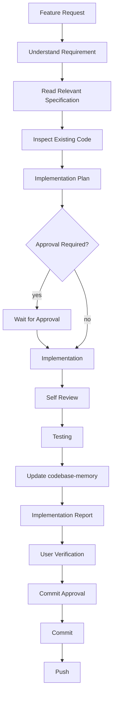

# Quick Start

1. Read this document (`ENGINEERING_WORKFLOW.md`).
2. Read only the relevant sections of `PROJECT_SPECIFICATION.md`.
3. Inspect the existing implementation.
4. Use relevant installed MCP servers, plugins, and skills only if they add value.
5. Implement only the requested scope.
6. Verify the implementation.
7. Update codebase-memory.
8. Wait for approval before committing.

# Engineering Workflow

This document defines how implementation work must be performed in this repository. Its audience is AI coding agents (OpenCode, Claude Code, Codex, Cursor, and similar).

`PROJECT_SPECIFICATION.md` is the architectural source of truth for this project. Where it and any other artefact disagree, the specification governs.

This document is **not** a project specification, not architecture documentation, and not a coding style guide. It defines the implementation *workflow* only. Every agent performing work in this repository must follow it.

---

# Core Principles

- The architecture is frozen unless explicitly revised through the defined process.
- Never redesign approved architecture during implementation.
- Prefer extending existing code over creating unnecessary abstractions.
- Keep changes cohesive and minimal.
- Preserve backwards compatibility whenever possible.
- Keep commits small and focused.
- Explain engineering decisions when introducing new behaviour.

---

# Implementation Process

1. Understand the requested feature and its intent.
2. Read only the relevant sections of `PROJECT_SPECIFICATION.md`.
3. Inspect the existing implementation before writing any code.
4. Identify the files affected by the change.
5. Produce an implementation plan when the scope is non-trivial.
6. Implement only the approved scope.
7. Review the implementation against the plan and the specification.
8. Verify functionality before reporting completion.
9. Update codebase-memory after successful implementation.
10. Wait for commit approval unless explicitly instructed otherwise.

---

# Reading Strategy

Do **not** read the entire `PROJECT_SPECIFICATION.md` unless explicitly requested.

Instead:

- Read only the sections relevant to the current feature.
- Read the related source files.
- Read the related API routers.
- Read the related database models.
- Avoid consuming unnecessary context.

---

# Tool Usage Policy

Use only the tools that add value to the current task. Prefer the smallest effective toolset.

**codebase-memory**

- Understand module dependencies and relationships.
- Find files affected by a change.
- Understand the existing architecture.

Do not rely on assumptions when the repository already contains the answer.

**Context7**

- Use only for framework, library, SDK, or API documentation.
- Do not use it when repository knowledge is sufficient.

**Playwright**

- Use only when user-visible behaviour changes.
- Prefer real browser validation over synthetic assertions.

**Installed Skills, Plugins, MCP Servers**

- Use only the ones relevant to the task.
- Avoid unnecessary tool invocations.

---

# Feature Workflow

---

# Code Quality

Before finishing implementation, verify:

- no duplicated logic,
- no unnecessary abstractions,
- no dead code,
- consistent naming,
- existing behaviour preserved,
- architecture unchanged,
- implementation matches `PROJECT_SPECIFICATION.md`.

---

# Testing

Testing depends on the feature under development.

Backend:

- API verification,
- database verification,
- unit tests where appropriate.

Frontend:

- manual verification,
- Playwright verification for user workflows.

Do not generate unnecessary automated tests.

---

# Playwright Usage

Use Playwright only when user-visible behaviour changes.

Examples:

- UI changes,
- navigation,
- forms,
- uploads,
- dashboards,
- interactions.

Prefer real browser validation over synthetic assertions when appropriate.

---

# Documentation

Update documentation only when implementation changes architecture, behaviour, APIs, workflows, or developer setup.

Avoid unnecessary documentation edits.

---

# Commits

Never commit automatically.

Wait for explicit user approval before:

- committing,
- pushing,
- creating tags.

---

# Deliverables

Every completed task should end with:

- **Summary** — what was done.
- **Files Changed** — list of modified or created files.
- **Tests Performed** — how functionality was verified.
- **Remaining Work** — anything deferred or incomplete.
- **Risks** — any concerns, if any.

---

# Scope Control

Implement only the requested feature.

Do not begin future roadmap items.

Do not perform unrelated refactoring.

Do not modify unrelated files.

---

# Engineering Mindset

Think like a senior software engineer working on a production-quality codebase.

Prioritize:

- correctness,
- maintainability,
- simplicity,
- consistency.

Avoid overengineering. Avoid speculative features. Prefer incremental improvements over large rewrites.

---

# Definition of Done

A feature is complete only if:

- ✅ Implementation matches `PROJECT_SPECIFICATION.md`.
- ✅ Existing functionality still works.
- ✅ No duplicated logic introduced.
- ✅ Relevant tests pass.
- ✅ Manual verification completed.
- ✅ Playwright verification completed (if UI changed).
- ✅ codebase-memory updated.
- ✅ Summary produced.

---

# Prompt Philosophy

Future implementation prompts should be concise.

They should reference this `ENGINEERING_WORKFLOW.md` instead of repeating engineering rules.

Prompts should contain only:

- feature goal,
- relevant `PROJECT_SPECIFICATION.md` sections,
- expected outcome,
- constraints specific to that feature.

Avoid repeating generic workflow instructions in every prompt.
