# Autonomous Coconut Harvesting System

## Engineering Specification

| Field | Value |
|-------|-------|
| **Project Name** | Autonomous Coconut Harvesting System |
| **Document Version** | v1.0 Draft |
| **Repository** | `autonomous-coconut-harvester` |
| **Last Updated** | 2026-07-14 |
| **Status** | Architecture Frozen — Implementation In Progress |
| **Owner** | Major Project Engineering Team |
| **Classification** | Internal Engineering Reference |

> This document is the **single source of truth** for the architecture, data
> model, and behaviour of the Autonomous Coconut Harvesting System. Where this
> document and any other artefact (README, ARCHITECTURE.md, CURRENT.md,
> DECISIONS.md, SpecKit files) disagree, this document governs. Other documents
> are scheduled to be reconciled to this specification after the next
> implementation cycle.

---

# Table of Contents

- [1. Executive Summary](#1-executive-summary)
- [2. Problem Statement](#2-problem-statement)
- [3. Project Objectives](#3-project-objectives)
- [4. Scope](#4-scope)
- [5. Out of Scope](#5-out-of-scope)
- [6. High-Level System Overview](#6-high-level-system-overview)
- [7. Survey Mission](#7-survey-mission)
- [8. Tile Processing Strategy](#8-tile-processing-strategy)
- [9. Tree Detection](#9-tree-detection)
- [10. GPS Generation Strategy](#10-gps-generation-strategy)
- [11. Tree Matching](#11-tree-matching)
- [12. Farm Digital Twin](#12-farm-digital-twin)
- [13. Tree Management](#13-tree-management)
- [14. Tree Data Model](#14-tree-data-model)
- [15. Tree Lifecycle](#15-tree-lifecycle)
- [16. Tree Availability](#16-tree-availability)
- [17. Coconut Inventory](#17-coconut-inventory)
- [18. Tree History](#18-tree-history)
- [19. Timestamp Strategy](#19-timestamp-strategy)
- [20. Climbing Robot System](#20-climbing-robot-system)
- [21. Coconut Scan Workflow](#21-coconut-scan-workflow)
- [22. Coconut Ripeness Detection](#22-coconut-ripeness-detection)
- [23. Coconut Inventory Generation](#23-coconut-inventory-generation)
- [24. Harvest Eligibility](#24-harvest-eligibility)
- [25. Inventory Refresh Strategy](#25-inventory-refresh-strategy)
- [26. Robot Operational States](#26-robot-operational-states)
- [27. Error Handling](#27-error-handling)
- [28. Farmer Dashboard](#28-farmer-dashboard)
- [29. Dashboard Layout](#29-dashboard-layout)
- [30. Farm Summary](#30-farm-summary)
- [31. Farm Digital Twin (user perspective)](#31-farm-digital-twin-user-perspective)
- [32. Tree Details Panel](#32-tree-details-panel)
- [33. Tree History](#33-tree-history)
- [34. Survey Mission History](#34-survey-mission-history)
- [35. Harvest Control](#35-harvest-control)
- [36. Harvest Mission Monitoring](#36-harvest-mission-monitoring)
- [37. Dashboard Analytics](#37-dashboard-analytics)
- [38. Harvest Planning System](#38-harvest-planning-system)
- [39. Harvest Request Workflow](#39-harvest-request-workflow)
- [40. Eligible Tree Selection](#40-eligible-tree-selection)
- [41. Route Planning Strategy](#41-route-planning-strategy)
- [42. Robot Queue](#42-robot-queue)
- [43. Harvest Mission](#43-harvest-mission)
- [44. Robot Task Execution](#44-robot-task-execution)
- [45. Robot Operational States](#45-robot-operational-states-1)
- [46. Pause / Resume / Cancel](#46-pause--resume--cancel)
- [47. Failure Recovery](#47-failure-recovery)
- [48. Backend Architecture](#48-backend-architecture)
- [49. Frontend Architecture](#49-frontend-architecture)
- [50. Database Architecture](#50-database-architecture)
- [51. API Architecture](#51-api-architecture)
- [52. Folder Structure](#52-folder-structure)
- [53. Error Handling Strategy](#53-error-handling-strategy)
- [54. Logging Strategy](#54-logging-strategy)
- [55. Security Considerations (Version 1)](#55-security-considerations-version-1)
- [56. Testing Strategy](#56-testing-strategy)
- [57. Performance Considerations](#57-performance-considerations)
- [58. Future Improvements](#58-future-improvements)
- [59. Architecture Decision Record (ADR)](#59-architecture-decision-record-adr)
- [60. Terminology](#60-terminology)
- [61. Development Roadmap](#61-development-roadmap)
- [62. Final End-to-End Workflow](#62-final-end-to-end-workflow)
- [Architecture Freeze](#architecture-freeze)

---

# 1. Executive Summary

The Autonomous Coconut Harvesting System is a software platform that turns a
single coconut plantation into a structured, queryable, and actionable digital
asset. It ingests drone imagery, detects coconut trees and the ripeness of their
fruit, assigns a permanent identity to every tree, plans harvest work, and
coordinates a climbing robot to collect the fruit. The system is built so that a
farmer can supervise the whole operation from a single dashboard rather than
walking the plantation row by row.

**Why it exists.** Manual coconut harvesting is labour-intensive, dangerous, and
poorly instrumented. A human climber must ascend each tree — often 15–25 metres
— with a sickle, which is a recurring source of serious falls and fatalities.
Meanwhile the farm itself has no digital record of where trees are, how many
coconuts each carries, or which trees are ready to harvest. Decisions about when
and where to send labour are made from memory and rough observation. This project
replaces that intuition with a measured pipeline: survey the farm from the air,
localise every tree, inspect each tree's fruit up close, and dispatch a robot to
those trees that actually need attention.

**Overall idea.** The product is deliberately split into two robotic actors with
two very different sensing payloads:

- A **drone** flies a coverage survey and produces a wide-area, top-down view of
  the plantation. Its job is *detection at scale*: "which pixels contain a tree"
  and "where is that tree in GPS terms". It is not expected to judge ripeness
  well, because a top-down view from altitude cannot reliably read the colour and
  texture cues that distinguish a mature coconut from a tender one.
- A **climbing robot** ascends an individual tree and captures a close-up view of
  the canopy. Its job is *precision inspection*: it re-photographs the tree and
  runs a separate ripeness model that is accurate precisely because it is close.

This separation is the central architectural decision. It matches the physics of
the problem: coarse sensing from altitude is cheap and covers the whole farm,
while fine sensing is expensive per tree but is the only way to get trustworthy
ripeness data. Combining the two into one vehicle would force a trade-off between
coverage speed and inspection quality that the project refuses to make.

**Current implementation status.** The repository currently implements a working
end-to-end baseline: YOLOv8 tree detection, GPS de-duplication into a `Tree`
table, YOLOv8 coconut-ripeness detection, harvest-preference gated task creation,
a bulk planner, a tree dashboard and map view, and a simulated robot that polls
for and completes tasks. The schema, however, is intentionally minimal and does
**not yet** contain the `SurveyMission`, `Tile`, full `Tree` lifecycle,
`Inventory`, `Robot Queue`/`Task` state machine, `HarvestMission`, or `History`
entities described in the frozen architecture. Those are the next implementation
targets. Where the current code differs from the frozen design, this document
labels the gap as **[Planned Enhancement]** so it is unambiguous what exists
versus what must be built.

**Long-term vision.** A farmer opens the dashboard, sees the plantation rendered
as a digital twin, triggers a drone survey, watches trees appear as permanent
markers, requests a harvest for the whole farm or a selection of trees, and lets
the system plan the robot's route and execute it — all while a complete,
never-deleted audit history records every mission, every detection, and every
harvest. The robot is simulated today; the same API contract is designed to be
driven by real hardware tomorrow without restructuring the backend.

---

# 2. Problem Statement

Coconut is a major plantation crop, but the act of harvesting it has barely
changed in decades. The problem this project addresses is the combination of
**physical risk**, **labour scarcity**, and **informational blindness** that
surrounds harvest operations.

**Manual harvesting is dangerous.** The dominant method worldwide is a human
climber carrying a sickle or knife, ascending an un‑protected trunk. Falls from
height are the leading cause of injury and death in coconut cultivation. Any
system that removes a person from the trunk directly reduces that risk.

**Labour shortage is structural.** Younger workers are unwilling to take up
tree-climbing as a livelihood, and seasonal labour is increasingly unreliable and
expensive. Plantations that were economically viable on cheap climbing labour are
losing that option. Mechanisation is not a luxury here; it is continuity of
production.

**Locating harvest-ready trees is hard.** A plantation may hold hundreds or
thousands of trees. Not every tree is ready at the same time: some have mostly
mature fruit, some are still tender, some are empty, some may have died. Without
a survey, the farmer either over-sends labour (wasting time on empty trees) or
under-harvests (leaving ripe fruit to spoil). The core economic question — "which
trees are worth visiting right now?" — has no cheap answer today.

**There is no digital inventory.** Farms run on paper, memory, or nothing. There
is no canonical list of trees, no GPS for each, no count of fruit per tree, and no
record of past harvests. This makes planning, insurance, yield estimation, and
even basic accounting impossible.

**Farm digitisation is the foundation, not a by-product.** The act of surveying
and localising trees *is* the creation of the farm's digital twin. Once trees
have permanent IDs and GPS, every later decision (ripeness, harvest, maintenance)
can be attached to a stable entity instead of re-discovered each season.

**Automation must respect the sensing trade-off.** The reason the architecture
uses *two* robots rather than one is physical. A drone at survey altitude captures
the whole plantation cheaply but cannot read ripeness reliably. A climber sees the
fruit clearly but can only visit one tree at a time. Splitting the work lets each
vehicle do what it is good at: the drone gives *coverage and localisation*, the
robot gives *precision and action*. Converging both roles into a single flying
manipulator would be far more complex and far less reliable for a student-scale
project.

**Ripeness detection is deliberately separate from tree detection.** The two
tasks use different models, different inputs, and answer different questions:

- *Tree detection* answers "is there a tree here, and where?" from a wide,
  top-down image. It must be fast and run over thousands of candidates.
- *Ripeness detection* answers "is this coconut mature, potential, or premature?"
  from a close-up image. It must be accurate and runs on a handful of fruit per
  tree.

Training one model to do both would require it to be simultaneously coarse and
fine-grained, and would couple two independent failure modes. Keeping them apart
means each model can be improved, replaced, or re-trained independently, and the
climbing robot's ripeness pass can be repeated without re-flying the survey.

---

# 3. Project Objectives

## 3.1 Functional Objectives

- **Detect coconut trees** from drone imagery using a dedicated tree-detection
  model (`tree_detector.pt`), returning bounding boxes and confidence scores.
- **Build a plantation map** by localising detected trees in GPS space and
  rendering them on a digital twin of the farm.
- **Generate permanent Tree IDs** so that every physical tree maps to exactly one
  stable database entity for the life of the project.
- **Detect coconut ripeness** using a separate close-up model
  (`coconut_detector.pt`) that classifies each coconut as `Mature`, `Potential`,
  or `Premature`.
- **Maintain inventory** of each tree's coconuts per ripeness class; inventory is
  *replaced* on every fresh scan rather than appended, so the database always
  reflects the latest observed state.
- **Plan harvesting** by filtering eligible trees according to the farmer's
  harvest preference and ordering them into a robot-executable route.
- **Manage robot tasks** through a queue with explicit lifecycle states
  (pending → in_progress → completed / cancelled) and stale-task reclamation.
- **Maintain history** of survey missions, harvest missions, and per-tree
  changes, retained indefinitely as an audit trail.
- **Supervise everything from a dashboard** that exposes the farm summary, mission
  summary, digital twin, tree details, robot queue, harvest history, and
  analytics.

## 3.2 Non-Functional Objectives

- **Simple architecture.** Favour a small number of well-understood services over
  a distributed microservice sprawl. The backend is a single FastAPI application;
  the frontend is a single Next.js application.
- **Offline demo capable.** The robot is simulated (`simulation/robot_simulator.py`)
  and the ML models run locally, so the full pipeline can be demonstrated without
  real hardware, real GPS, or external paid services.
- **Low cost.** PostgreSQL (Neon) on a free/cheap tier, open-source YOLOv8, and no
  paid APIs. The model weights and `.env` are gitignored and local-only.
- **Student project appropriate.** The system is buildable and maintainable by a
  small team with standard Python/TypeScript skills; no exotic infrastructure.
- **Modular.** Perception, mapping, planning, simulation, and API layers are
  separated into distinct directories so each can be developed and tested alone.
- **Explainable AI.** Detection outputs carry bounding boxes, per-object
  confidence, and ripeness class labels, so every decision can be traced to model
  evidence rather than a black-box score.
- **Easy future expansion.** Frozen decisions (permanent IDs, immutable missions,
  GPS-proximity matching, nearest-neighbour planning) are chosen so that later
  features — real GPS hardware, multiple farms, verification scans — slot in
  without redesign.

---

# 4. Scope

This project **includes** the following subsystems, each either implemented in the
current baseline or specified as a near-term build target:

1. **Survey Mission management** — folder upload of drone imagery, tile
   extraction, immutable mission records, and a single ACTIVE mission with prior
   missions marked SUPERSEDED. *[Planned Enhancement — current code uploads a
   single image at a time via `POST /detect/trees` and has no mission/tile
   concept.]*
2. **Tile processing** — splitting a surveyed plantation image into georeferenced
   tiles for tractable detection. *[Planned Enhancement.]*
3. **Tree detection** — YOLOv8 top-down tree localisation. *Implemented
   (`backend/api/tree_api.py`, `models/tree_model/tree_detector.pt`).*
4. **Tree matching & permanent IDs** — GPS-proximity de-duplication (4 m
   threshold) so repeated observations map to one tree. *Implemented in principle
   (`backend/api/drone_api.py` `gps_distance`, 4 m threshold); the permanent-ID
   lifecycle and availability states are [Planned Enhancement].*
5. **Farm Digital Twin** — the drone-captured plantation image as the map
   background with tree markers, tile boundaries, robot, and paths overlaid.
   *Partial — current map uses OpenStreetMap tiles (`frontend/components/MapView.tsx`);
   the drone-image-backed twin is [Planned Enhancement].*
6. **Tree database** — PostgreSQL tables for trees, detections, and tasks.
   *Implemented at minimal schema (`backend/database/models.py`); expanded model
   is [Planned Enhancement].*
7. **Climbing robot & ripeness detection** — close-up capture, ripeness
   classification, inventory replacement, timestamp update. *Ripeness model
   implemented (`backend/api/coconut_api.py`, `models/coconut_model/coconut_detector.pt`);
   the robot workflow / inventory replacement is [Planned Enhancement].*
8. **Dashboard** — farm summary, mission summary, digital twin, tree details,
   robot queue, harvest history, analytics. *Partial — dashboard, tree detail, map,
   and robot pages exist (`frontend/app/*`); mission/history/analytics views are
   [Planned Enhancement].*
9. **Harvest Planner** — eligibility filtering and nearest-neighbour ordering.
   *Partial — `GET /planner/harvest_order` sorts by mature count
   (`backend/api/harvest_planner.py`); nearest-neighbour route planning and
   eligibility filtering are [Planned Enhancement].*
10. **Robot Queue & Harvest Mission** — task lifecycle, assignment, completion,
    pause/resume/cancel, single running mission. *Partial — tasks and a polling
    robot exist; mission pause/resume/cancel and robot state machine are
    [Planned Enhancement].*
11. **History system** — mission, harvest, and tree audit trails. *[Planned
    Enhancement.]*

---

# 5. Out of Scope

The following capabilities are **intentionally excluded** from this project. Each
is excluded for a stated reason; none is excluded by accident.

- **ROS (Robot Operating System).** Excluded because the robot is simulated and
  the single FastAPI backend already owns orchestration. ROS would add
  middleware complexity, a build toolchain, and messaging infrastructure with no
  benefit at student-project scale. The robot is driven through plain HTTP
  endpoints instead.
- **SLAM (Simultaneous Localisation and Mapping).** Excluded because the farm is a
  single, known, bounded plantation surveyed by a drone; we do not need the robot
  to build a map of an unknown environment. Tree GPS is supplied by the survey,
  not inferred by the robot.
- **Multi-farm support.** Excluded by the frozen decision "single plantation
  only". One farm keeps the data model, the digital twin, and the UI simple. A
  multi-tenant design would require farm scoping on every query and is deferred to
  a future consideration.
- **Multiple climbing robots.** Excluded by the frozen decision "one climbing
  robot". A single robot removes concurrency, contention, and fleet-routing
  concerns. Scaling to a fleet is a future consideration, not a current requirement.
- **Drone telemetry.** Excluded because we consume the *result* of a flight
  (the image folder) rather than live telemetry streams. Real-time attitude,
  battery, and link state are not needed to plan a harvest.
- **Real RTK/hardware GPS.** Excluded so the system runs offline and demoable
  without survey-grade hardware. The current pipeline derives GPS from the chosen
  bounding-box position relative to a fixed origin (see
  `frontend/components/DroneUploader.tsx`). Real geotagging is a future
  enhancement.
- **Orthomosaic / stitching.** Excluded because stitching many drone photos into
  one georeferenced orthophoto is a heavy CV pipeline (e.g. OpenDroneMap) and is
  not required for tree detection or the digital twin; the drone-captured
  plantation image is used directly as the background.
- **Paid APIs.** Excluded to keep the project free to run and free to submit. All
  ML, storage, and mapping in the baseline use open-source or free-tier components.
- **Automatic verification scan after harvesting.** Excluded by the frozen
  decision "no verification scan after harvesting". The robot reports completion
  and the system trusts it; a re-scan to confirm emptiness would double the robot
  work for marginal benefit at this stage.
- **Autonomous navigation.** Excluded because the robot's movement between trees
  is treated as a planning/routing concern, not a perception-and-control problem.
  The robot polls tasks and reports completion; how it physically drives is out of
  scope.
- **Hardware control.** Excluded — the climbing robot and drone are simulated or
  driven externally. The repository defines the *contract* (HTTP APIs) the hardware
  would satisfy, not the motor/actuator control.
- **Authentication / multi-user accounts.** Excluded for the student-project
  scope; the dashboard is a single-operator view. A future consideration is
  role-based access for farm managers.

---

# 6. High-Level System Overview

The system is organised as a pipeline of cooperating subsystems. Data flows in one
primary direction — survey → detect → localise → inspect → plan → execute →
record — with the dashboard observing every stage.

### 6.1 Subsystem responsibilities

- **Survey Mission.** A farmer uploads a folder of drone imagery for a coverage
  survey of the plantation. The mission is recorded immutably; exactly one mission
  is ACTIVE and earlier missions are marked SUPERSEDED when a newer one is
  accepted. *[Planned Enhancement — current code has no mission entity.]*

- **Tree Detection.** Each surveyed tile/image is run through the YOLOv8 tree
  model (`tree_detector.pt`). Output is a list of bounding boxes with confidence.
  *Implemented at single-image level (`POST /detect/trees`).*

- **Tree Matching.** Detected tree positions are matched to existing permanent
  trees by GPS proximity (4 m threshold). A new detection within range of an
  existing tree updates that tree's observation history; a detection far from any
  existing tree creates a new permanent Tree. *Implemented in `drone_api.register_tree`;
  the full availability/lifecycle wrapping is [Planned Enhancement].*

- **Farm Digital Twin.** The drone-captured plantation image is rendered as the
  base map. Over it sit tree markers, tile boundaries, the robot position, and
  planned paths. *[Planned Enhancement — current map uses OpenStreetMap tiles.]*

- **Tree Database.** PostgreSQL stores trees, detections, tasks, and (planned)
  missions, tiles, inventory, queue items, and history. It is the system of
  record. *Implemented at minimal schema; expanded model is [Planned Enhancement].*

- **Climbing Robot.** For a selected tree, the robot ascends and captures a
  close-up image, which is passed to ripeness detection. On completion it replaces
  the tree's inventory and updates timestamps. *Ripeness inference implemented;
  robot workflow is [Planned Enhancement].*

- **Ripeness Detection.** The YOLOv8 coconut model (`coconut_detector.pt`)
  classifies each detected coconut as `Mature`, `Potential`, or `Premature` with a
  confidence. *Implemented (`POST /detect/coconuts`, `POST /drone/detection`).*

- **Dashboard.** The operator-facing Next.js application: farm summary, mission
  summary, digital twin, tree details, robot queue, harvest history, analytics.
  *Partial implementation; mission/history/analytics views are [Planned
  Enhancement].*

- **Harvest Planner.** Consumes eligible trees (filtered by harvest preference and
  non-empty inventory) and orders them into a route using the nearest-neighbour
  heuristic. *Partial — count-based ordering exists; nearest-neighbour +
  eligibility filtering is [Planned Enhancement].*

- **Robot Queue.** The ordered set of harvest tasks assigned to the single robot,
  each with a lifecycle (pending, in_progress, completed, cancelled) and
  pause/resume semantics. *Partial — tasks exist; queue/mission semantics are
  [Planned Enhancement].*

- **Harvest Mission.** The unit of execution: exactly one harvest mission runs at
  a time, with states CREATED → RUNNING → PAUSED → COMPLETED / CANCELLED. *[Planned
  Enhancement.]*

- **History System.** Append-only records of survey missions, harvest missions,
  and per-tree state changes, retained forever for audit. *[Planned Enhancement.]*

### 6.2 High-level workflow

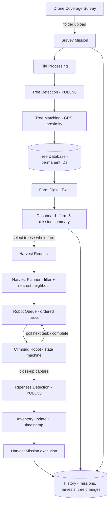
```mermaid
flowchart TD
    A[Drone Coverage Survey] -->|folder upload| B[Survey Mission]
    B --> C[Tile Processing]
    C --> D[Tree Detection - YOLOv8]
    D --> E[Tree Matching - GPS proximity]
    E --> F[(Tree Database - permanent IDs)]
    F --> G[Farm Digital Twin]
    G --> H[Dashboard - farm & mission summary]
    H -->|select trees / whole farm| I[Harvest Request]
    I --> J[Harvest Planner - filter + nearest neighbour]
    J --> K[Robot Queue - ordered tasks]
    K --> L[Climbing Robot - state machine]
    L -->|close-up capture| M[Ripeness Detection - YOLOv8]
    M --> N[Inventory update + timestamp]
    N --> O[Harvest Mission execution]
    O --> P[(History - missions, harvests, tree changes)]
    H --> P
    B --> P
    L -->|poll next task / complete| K
```

*End of Part 1. Sections 7 onward follow in subsequent parts.*

---

# 7. Survey Mission

## 7.1 Purpose

A **Survey Mission** is the atomic unit of farm data acquisition. It represents
one complete drone coverage flight over the plantation, delivered to the system as
a folder of images. Its purpose is to capture a fresh, whole-of-farm observation
that the system can turn into tree records, an updated digital twin, and (later) a
harvest plan. A mission is the *snapshot* against which all subsequent
detection, matching, and planning decisions are understood.

## 7.2 Responsibilities

The Survey Mission subsystem is responsible for:

- Accepting a folder of drone imagery for one coverage flight.
- Recording immutable mission metadata (creation time, source folder, status).
- Tracking tile processing progress until the mission is complete.
- Marking exactly one mission ACTIVE at any time.
- Superseding the previously ACTIVE mission when a newer one is completed.
- Preserving every past mission forever as historical record.

It is **not** responsible for detecting trees, matching trees, or planning
harvests — those are downstream subsystems that *read* the active mission's output.

## 7.3 Inputs and Outputs

| | Description |
|---|---|
| **Inputs** | A folder of drone images (JPEG/PNG) covering the plantation, plus a single base plantation GPS coordinate supplied by the user. |
| **Outputs** | An immutable `SurveyMission` record, a set of `Tile` records, and (via downstream detection) tree observations tied to that mission. |

## 7.4 Folder upload workflow

The farmer selects a folder rather than a single file. The upload handler:

1. Validates the folder is non-empty and contains image files.
2. Creates a `SurveyMission` in status `PROCESSING` (or an initial ingest state).
3. Extracts images into tiles (see §8) and creates one `Tile` per image, ordered
   by capture sequence.
4. Runs tree detection + matching per tile, accumulating observations.
5. On completion, marks the mission `COMPLETED`, sets it `ACTIVE`, and marks the
   previously ACTIVE mission `SUPERSEDED`.

*[Planned Enhancement — the current implementation uploads one image at a time via
`POST /detect/trees` and has no mission or folder concept. The workflow above is
the frozen target.]*

## 7.5 Why folder upload instead of single-image upload

- **Whole-farm context.** A single image is a tiny fragment of a plantation. A
  harvest plan must reason over *all* trees, so the system needs the complete
  coverage set. A folder is the natural unit that represents one flight.
- **Ordering and continuity.** A folder preserves the capture sequence, which lets
  the system reconstruct tile order, detect overlaps, and attribute detections to
  the correct spatial region.
- **Progress accounting.** A folder gives a countable unit of work (N tiles), so
  mission progress and partial-failure restart are well defined. A stream of
  unrelated single uploads would make "is the survey done?" unanswerable.

## 7.6 Standard drone height assumption

The system assumes a **fixed, standard survey altitude** (a configurable constant,
e.g. ~40–60 m AGL) at which the drone captures each tile. This assumption is what
makes the GPS-generation math in §10 tractable: at a known altitude and known
camera field of view, one pixel offset corresponds to a deterministic ground
distance. The exact value is configurable and is *not* derived from live telemetry
by design (see §5, §10).

## 7.7 Why a single image cannot cover a plantation

A drone camera has a fixed field of view. At a safe survey altitude, one frame
covers only a small ground footprint (tens of metres across). A plantation spans
hundreds of metres. A single image would either (a) be taken so high that trees
are sub-pixel and undetectable, or (b) cover only a corner of the farm. Therefore
the plantation must be captured as many frames along a coverage path
(`mapping/coverage_path.py` already generates a lawnmower path for this).

## 7.8 Why the plantation is divided into tiles

"Tile" is the term for one captured frame, georeferenced by its position in the
coverage grid. Tiling exists because:

- Detection models have a finite, well-performing input resolution. Running YOLO
  on a single giant stitched image would blow up memory and degrade small-object
  recall.
- Per-tile processing gives natural parallelism and resumability.
- Each tile maps to a known ground region, which is what lets §10 turn a
  bounding-box centre into realistic GPS.

## 7.9 Mission creation and completion process

**Creation:** the folder upload instantiates a `SurveyMission` with `created_at`
(UTC), `source_folder`, `status = PROCESSING`, and `is_active = false`. Tiles are
created in `PENDING`.

**Completion:** once all tiles reach a terminal state, the mission transitions to
`COMPLETED`, `is_active` is set `true`, and the previously active mission is flipped
to `SUPERSEDED`. The digital twin is rebuilt from the completed mission's tiles and
tree observations.

## 7.10 Mission history and metadata

Every mission stores, at minimum:

- `id` — internal primary key.
- `created_at` — UTC timestamp of ingestion.
- `completed_at` — UTC timestamp of completion (nullable while processing).
- `source_folder` — original folder name/path.
- `status` — one of the lifecycle values in §7.12.
- `is_active` — boolean, true for at most one row.
- `tile_count` / `processed_count` — for progress.
- `base_gps_lat` / `base_gps_lon` — the user-supplied plantation origin.

History is **never pruned**: every mission, even `SUPERSEDED`, remains queryable so
that "what did the farm look like on date X?" is always answerable.

## 7.11 Why missions are immutable

Once a mission is `COMPLETED`, its tiles, detections, and the tree observations it
produced are frozen. Immutability guarantees that historical analysis, audit, and
reconciliation are reproducible: re-reading a past mission yields the same data it
did on the day it ran. Mutating a completed mission would corrupt the audit trail
and make "SUPERSEDED vs ACTIVE" meaningless.

## 7.12 Mission status definitions

| Status | Meaning |
|---|---|
| `PROCESSING` | Folder ingested; tiles are being detected/matched. |
| `COMPLETED` | All tiles terminal; mission is the new source of truth. |
| `ACTIVE` | The single current source of truth for the digital twin and planning. (A `COMPLETED` mission becomes `ACTIVE`; modeled here as the `is_active` flag rather than a distinct status to keep one-row-active invariant simple.) |
| `SUPERSEDED` | A previously ACTIVE mission replaced by a newer one. Retained read-only. |
| `FAILED` | Ingestion or processing failed irrecoverably; retained for audit. |

## 7.13 ACTIVE, SUPERSEDED, and the one-active invariant

Exactly one mission is `ACTIVE` (`is_active = true`). When a new mission completes,
the old active mission becomes `SUPERSEDED`. There is no "delete the old one"
step — supersession is a *status change*, not a removal, because the old mission's
tree observations and imagery remain the only record of the farm's prior state.

## 7.14 Survey Mission lifecycle (state diagram)

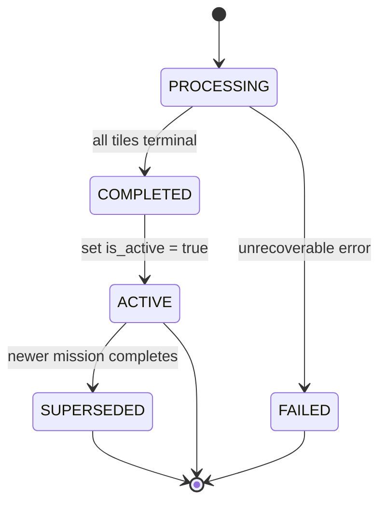
```mermaid
stateDiagram-v2
    [*] --> PROCESSING
    PROCESSING --> COMPLETED: all tiles terminal
    PROCESSING --> FAILED: unrecoverable error
    COMPLETED --> ACTIVE: set is_active = true
    ACTIVE --> SUPERSEDED: newer mission completes
    SUPERSEDED --> [*]
    FAILED --> [*]
    ACTIVE --> [*]
```

## 7.15 Survey Mission execution (sequence diagram)

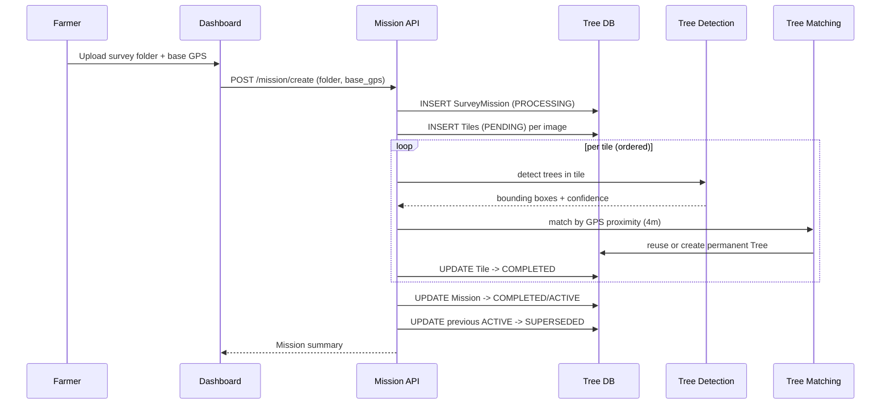
```mermaid
sequenceDiagram
    participant F as Farmer
    participant UI as Dashboard
    participant API as Mission API
    participant DB as Tree DB
    participant DET as Tree Detection
    participant MAT as Tree Matching

    F->>UI: Upload survey folder + base GPS
    UI->>API: POST /mission/create (folder, base_gps)
    API->>DB: INSERT SurveyMission (PROCESSING)
    API->>DB: INSERT Tiles (PENDING) per image
    loop per tile (ordered)
        API->>DET: detect trees in tile
        DET-->>API: bounding boxes + confidence
        API->>MAT: match by GPS proximity (4m)
        MAT->>DB: reuse or create permanent Tree
        API->>DB: UPDATE Tile -> COMPLETED
    end
    API->>DB: UPDATE Mission -> COMPLETED/ACTIVE
    API->>DB: UPDATE previous ACTIVE -> SUPERSEDED
    API-->>UI: Mission summary
```

---

# 8. Tile Processing Strategy

## 8.1 Why tiles are necessary

Detection quality and resource cost both force tiling. A YOLOv8 model is trained
and performs best at a specific input resolution; feeding it one enormous stitched
image would (a) exceed GPU/image memory, (b) shrink trees to a few pixels, and
(c) prevent per-region progress tracking. Tiles keep each inference within the
model's comfort zone and make the work divisible.

## 8.2 Tile overlap

Adjacent tiles deliberately **overlap** by a configurable margin (e.g. 10–15% of
the frame). Overlap exists so that a tree sitting on a tile boundary is captured
fully in at least one tile rather than clipped and missed. The overlap is resolved
downstream by Tree Matching (§11): duplicate detections in the overlap zone map to
the same permanent Tree via GPS proximity, so overlap does not create duplicate
trees.

## 8.3 Tile ordering

Tiles are processed in the **coverage-path order** produced by
`mapping/coverage_path.py` (a lawnmower / boustrophedon sweep). Ordering matters
because it lets progress be reported as "tile k of N" and lets the digital twin be
revealed in a spatially coherent sweep rather than in random jumps.

## 8.4 Processing sequence

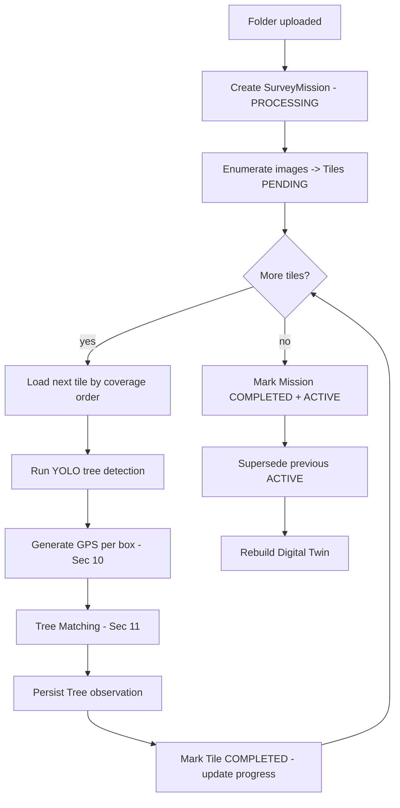
```mermaid
flowchart TD
    A[Folder uploaded] --> B[Create SurveyMission - PROCESSING]
    B --> C[Enumerate images -> Tiles PENDING]
    C --> D{More tiles?}
    D -->|yes| E[Load next tile by coverage order]
    E --> F[Run YOLO tree detection]
    F --> G[Generate GPS per box - Sec 10]
    G --> H[Tree Matching - Sec 11]
    H --> I[Persist Tree observation]
    I --> J[Mark Tile COMPLETED - update progress]
    J --> D
    D -->|no| K[Mark Mission COMPLETED + ACTIVE]
    K --> L[Supersede previous ACTIVE]
    L --> M[Rebuild Digital Twin]
```

## 8.5 Mission progress and progress tracking

Each `Tile` carries a status (`PENDING`, `PROCESSING`, `COMPLETED`, `FAILED`). Mission
progress is `processed_count / tile_count`. The dashboard reads this to show a
progress bar and to decide when the mission is safe to activate.

## 8.6 Tile boundaries

Tile boundaries are stored (the tile's ground footprint derived from its grid
position and the standard altitude). They are rendered on the digital twin (§12)
so the farmer can see exactly which regions were surveyed and where overlaps
occurred. Boundaries also support future partial re-surveys of a single region.

## 8.7 Error handling and partial failures

A tile may fail detection (corrupt image, model error). The failure is contained:
the tile is marked `FAILED`, the mission remains `PROCESSING`, and sibling tiles
continue. A mission only becomes `FAILED` if a tile fails in a way that blocks
completion *and* the operator chooses not to retry; otherwise the single bad tile
is retried while the rest proceed.

## 8.8 Restart behaviour

Because missions are immutable only after `COMPLETED`, an in-flight `PROCESSING`
mission can be **restarted**: only `PENDING`/`FAILED` tiles are re-processed;
already `COMPLETED` tiles are skipped. This makes a crash mid-mission recoverable
without re-detecting the whole farm. Completed missions are never restarted — a new
upload creates a new mission.

---

# 9. Tree Detection

## 9.1 Role within the pipeline

Tree Detection is the perception front-end of the survey. It answers a single
question: *"within this tile, which regions contain a coconut tree, and how
confident are we?"* It deliberately stops short of ripeness — that is the climbing
robot's job (§later). Keeping the two models separate is a frozen decision (§5,
§2).

## 9.2 YOLO model

The tree detector is an Ultralytics YOLOv8 model trained on the
`coconut-tree-detector2` dataset (single class `coconut_tree`, `nc: 1`), persisted
as `models/tree_model/tree_detector.pt`. It is loaded once at backend start
(`backend/api/tree_api.py`) and invoked on each tile.

*[Implementation note: the current `tree_api.detect_trees` runs the model at
`conf=0.4` and returns bounding boxes + confidence. The mission/tile wrapper around
it is [Planned Enhancement].]*

## 9.3 Input and output

- **Input:** one tile image (decoded via OpenCV `cv2.imdecode`).
- **Output:** a list of detections, each with `x1, y1, x2, y2` (pixel
  coordinates), an integer `id` (index within the tile), and a `confidence` float.
  The annotated image is also returned for UI display.

## 9.4 Bounding boxes and confidence

Each bounding box is the axis-aligned rectangle the model predicts around a tree
canopy. The **confidence** is the model's objectness × class probability. A
confidence threshold (currently `0.4`) filters weak false positives before they
ever become candidate trees, reducing noise in the digital twin.

## 9.5 Tree localisation

Localisation converts a pixel box into a ground position. The box centre
`((x1+x2)/2, (y1+y2)/2)` is combined with the tile's ground footprint and the
standard-altitude assumption (§7.6, §10) to produce a latitude/longitude. This is
the generated-GPS strategy, not EXIF/telemetry (§10).

## 9.6 Detection filtering

Before matching, detections are filtered by:

- **Confidence threshold** — drop boxes below the configured minimum.
- **Non-maximum suppression** — already handled inside YOLO; ensures one box per
  tree, not many overlapping boxes.
- **Size sanity** — optionally drop boxes far outside the expected canopy pixel
  size for the survey altitude (deferred to implementation).

## 9.7 Detection storage and pipeline

A detection is *transient* until it is matched. The pipeline is:

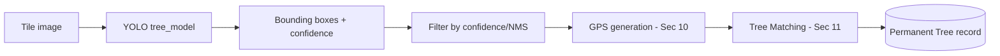
```mermaid
flowchart LR
    A[Tile image] --> B[YOLO tree_model]
    B --> C[Bounding boxes + confidence]
    C --> D[Filter by confidence/NMS]
    D --> E[GPS generation - Sec 10]
    E --> F[Tree Matching - Sec 11]
    F --> G[(Permanent Tree record)]
```

Detections themselves may be persisted as observation rows for audit, but the
authoritative output is the permanent `Tree` (or an update to an existing one)
produced by matching. A detection never becomes a `Tree` directly — it is always
routed through Tree Matching so IDs stay permanent and de-duplicated.

---

# 10. GPS Generation Strategy

## 10.1 What we do NOT use

The project **intentionally does not** read GPS from:

- **EXIF metadata** in the image (cameras/drones rarely geotag reliably, and the
  demo images have none).
- **Live drone telemetry** (no telemetry feed is consumed — see §5).
- **Real RTK GPS** hardware (excluded to keep the system offline and free).
- **Real drone coordinates** broadcast during flight.

All of the above would couple the pipeline to specific hardware and prevent a
reliable offline demo. They are explicitly out of scope.

## 10.2 What we DO use: simulated GPS from a base coordinate

The user supplies **one base plantation GPS coordinate** (the approximate corner
or centre of the farm). Every detected tree receives a generated latitude/longitude
computed from:

1. **Bounding-box centre** — the tree's pixel position within its tile.
2. **Tile position** — which cell of the coverage grid the tile occupies.
3. **Configurable spacing** — the ground distance between adjacent tile centres at
   the standard survey altitude.
4. **Relative offsets** — the box-centre pixel offset converted to metres via the
   altitude→ground-scale factor, then to degrees.

In formula terms:

```
tile_lat = base_lat + (tile_row * spacing_lat)
tile_lon = base_lon + (tile_col * spacing_lon)
box_offset_m = (box_centre_px - image_centre_px) * metres_per_pixel
tree_lat = tile_lat + offset_m_lat
tree_lon = tile_lon + offset_m_lon
```

The current single-image baseline already performs a simplified version of this in
`frontend/components/DroneUploader.tsx` (box-centre offset from a fixed Bengaluru
origin, `GPS_STEP_LAT/LON = 0.001`). The mission system generalises it across tiles
using the coverage grid.

## 10.3 Why this simulation approach was chosen

- **Hardware independence.** No drone, GPS module, or telemetry parser is required
  to demonstrate the full system.
- **Determinism.** Given the same folder and base coordinate, the system produces
  the same tree positions, which makes testing and grading reproducible.
- **Pedagogical clarity.** The spatial relationship (which tree is where relative
  to the base) is explicit and controllable, which is more useful for a student
  project than opaque real-world coordinates.
- **Cost.** Free to run; no survey-grade GNSS needed.

## 10.4 Why generated GPS stays realistic

The spacing and `metres_per_pixel` constants are derived from the *real* standard
survey altitude and a typical drone camera FOV, so the generated coordinates are
internally consistent: trees that are physically close in the imagery are close in
generated GPS, and the overall spread matches a real plantation's footprint. The
values are not random — they preserve neighbourhood structure, which is exactly
what Tree Matching and route planning need.

## 10.5 Generated GPS becomes permanent

Once a tree is created, its generated `gps_lat` / `gps_lon` are **permanent** (§11).
They are the tree's identity in space for the life of the project, even though they
were simulated. This is safe because the *relative* geometry is what drives
matching and planning; the absolute datum is a demonstration choice.

## 10.6 Future real-GPS integration

A future version may replace the generator with real geotagging (EXIF or RTK).
This is a **Future Consideration**, not a design target for v1. The interface
(generate a lat/lon per detection) is stable, so swapping the implementation will
not disturb Tree Matching, the digital twin, or the planner.

---

# 11. Tree Matching

## 11.1 Purpose and importance

Tree Matching is the subsystem that converts a stream of *per-survey detections*
into a stable set of *permanent trees*. It is the linchpin of the entire data model
because it is what makes a tree's history, inventory, and harvest status coherent
across many surveys. Without it, every flight would create a fresh, disconnected
set of trees and all historical meaning would be lost.

## 11.2 Frozen invariants

These are non-negotiable (from the frozen engineering decisions):

- **Tree IDs are permanent.** Once assigned, an ID is never changed.
- **Tree IDs are never reused.** A deleted/retired ID is never recycled.
- **Trees are never deleted.** A tree may become `MISSING` or `INACTIVE`, but its
  row persists forever.
- **Multiple tile observations can map to the same Tree.** Overlap (§8.2) and
  repeated surveys both converge on one permanent entity.
- **GPS-proximity matching** with a fixed threshold decides reuse vs. creation.

## 11.3 Algorithm

For each new detection with generated GPS `(lat, lon)`:

1. Load all existing `Tree` rows.
2. Compute `gps_distance(lat, lon, t.gps_lat, t.gps_lon)` using the Haversine
   formula (great-circle distance in metres — implemented in
   `backend/api/drone_api.py`).
3. If any existing tree is within **`DISTANCE_THRESHOLD = 4` metres**, the detection
   is treated as an *observation of that existing tree*: update its last-seen
   timestamp / observation count, do **not** create a new ID.
4. Otherwise the detection is a *new tree*: insert a `Tree` with a fresh permanent
   ID and the generated GPS.

```
DISTANCE_THRESHOLD = 4  # metres

def match_tree(lat, lon):
    for t in existing_trees:
        if gps_distance(lat, lon, t.lat, t.lon) < DISTANCE_THRESHOLD:
            return t            # reuse permanent ID
    return create_tree(lat, lon)  # new permanent ID
```

The 4 m threshold reflects the expected localisation error of the generated-GPS
method at the standard altitude plus the typical canopy radius — close enough that
two detections of one tree merge, far enough that two distinct adjacent trees do
not.

## 11.4 Decision diagram

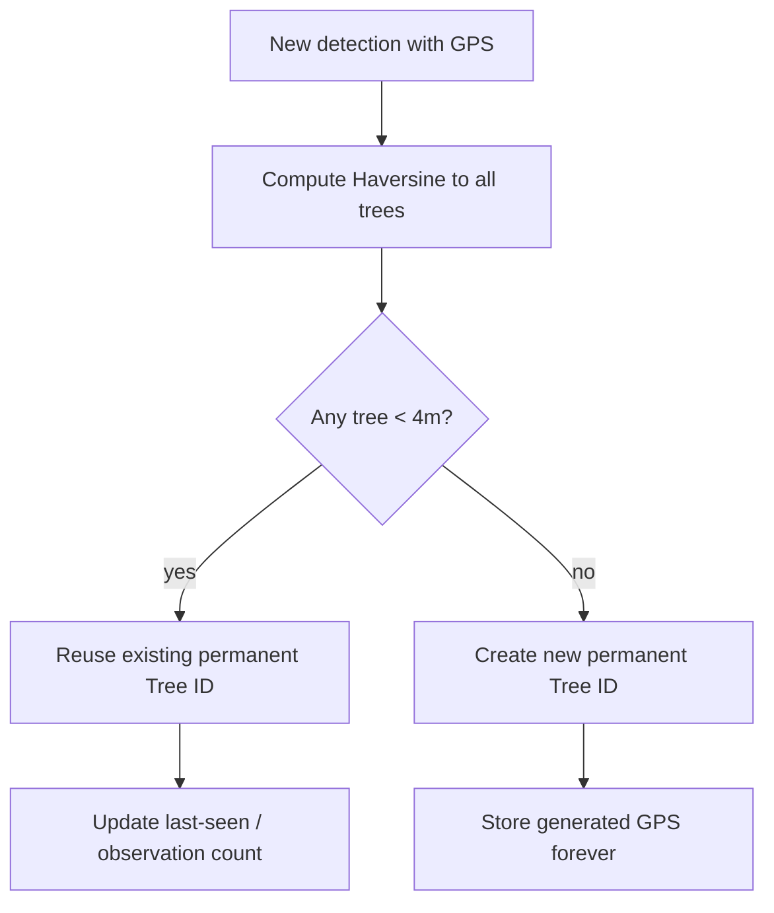
```mermaid
flowchart TD
    A[New detection with GPS] --> B[Compute Haversine to all trees]
    B --> C{Any tree < 4m?}
    C -->|yes| D[Reuse existing permanent Tree ID]
    D --> E[Update last-seen / observation count]
    C -->|no| F[Create new permanent Tree ID]
    F --> G[Store generated GPS forever]
```

## 11.5 Disappearance across surveys

When a tree present in a prior ACTIVE mission is **absent** from a new ACTIVE
mission, it is not deleted. Its availability transitions:

```
ACTIVE  --(not observed in new mission)-->  MISSING
MISSING --(still absent after N missions)--> INACTIVE
```

- **MISSING** means "expected but not seen in the latest survey" — perhaps
  occluded, or the tile failed. It is a soft signal.
- **INACTIVE** means "repeatedly missing" — the tree is presumed gone (felled,
  collapsed) or permanently unobservable. The row stays so history is intact.

Deletion is avoided because the tree's past detections, inventories, and harvests
are part of the farm's permanent record; removing it would erase audit data and
break foreign keys from history tables.

## 11.6 Why permanent IDs preserve history

Every Detection, Inventory snapshot, Task, and History entry references a permanent
`tree_id`. Because that ID never moves and never gets reused, a query like "show me
everything that ever happened to tree 42" is always answerable, even across
superseded missions and availability changes. Reuse of IDs (the 4 m rule) means a
tree detected in ten different tiles over five surveys still has exactly one ID, so
its timeline is continuous rather than fragmented.

## 11.7 Worked examples

**Example 1 — reuse.** Survey 1 detects a tree at (12.97160, 77.59460) → Tree #1.
Survey 2 detects a tree at (12.97161, 77.59461) → distance ≈ 1.4 m < 4 m → reused as
Tree #1. No new ID.

**Example 2 — new.** Survey 1 detects at (12.97160, 77.59460) → Tree #1. A second
detection at (12.97160, 77.59560) → distance ≈ 105 m → new Tree #2.

**Example 3 — overlap.** Tile A and Tile B overlap; both detect the same canopy at
nearly identical GPS → both match the same Tree #1; only one row exists.

**Example 4 — disappearance.** Tree #5 is `ACTIVE` after Survey 1. Survey 2 does not
observe it → #5 becomes `MISSING`. Survey 3 also omits it → #5 becomes `INACTIVE`.
The row, and all its history, remain.

---

# 12. Farm Digital Twin

## 12.1 Concept

The **Farm Digital Twin** is the visual, interactive representation of the
plantation that the operator sees and clicks. It is not a 3D simulation — it is a
2D georeferenced canvas: the drone-captured plantation image as the base layer, with
vector overlays for trees, tiles, the robot, and routes. It is the bridge between
the raw survey data and the farmer's mental model of the farm.

## 12.2 Why OpenStreetMap was rejected

The current map (`frontend/components/MapView.tsx`) uses OpenStreetMap raster tiles
as a placeholder. For the production digital twin, OSM is **rejected** as the base
layer because:

- OSM shows roads, buildings, and labels — not the plantation's trees or rows. It
  adds visual noise and tells the farmer nothing about *their* farm.
- OSM has no knowledge of individual trees; it cannot host our permanent tree
  markers in a meaningful farm context.
- OSM requires network access and a third-party tile server, undermining the
  offline-demo goal.
- The drone image *is* the farm; OSM is a generic map of somewhere else.

The frozen decision therefore states: *the drone-captured plantation image becomes
the Farm Digital Twin.*

## 12.3 Why the drone image is the visual foundation

The drone-captured plantation image is:

- **Authentic** — it is literally the farmer's farm from above.
- **Self-contained** — no external tiles, works offline.
- **Georeferenced by construction** — because tiles were laid out on the coverage
  grid (§8), the stitched/displayed image already maps to the generated GPS space.
- **Informative** — the farmer sees canopy health, spacing, and gaps directly.

It is the only base layer that is both meaningful and free.

## 12.4 Overlays

The digital twin renders, on top of the base image:

| Overlay | Purpose |
|---|---|
| **Background image** | The drone-captured plantation imagery, aligned to generated GPS. |
| **Tree markers** | One marker per permanent Tree, labelled with its permanent ID; coloured by availability/status. |
| **Permanent IDs** | Each marker shows its immutable `tree_id` so the UI, history, and robot all speak one identifier. |
| **Tile boundaries** | Outlines of each surveyed tile, showing coverage and overlap. |
| **Robot position** | The climbing robot's current location (during execution). |
| **Robot route** | The ordered path the planner produced (nearest-neighbour, §later). |
| **Harvest status** | Per-tree colour/icon reflecting lifecycle state (e.g. ready, harvesting, harvested). |
| **Selected tree** | Highlight of the tree currently opened in the detail view. |
| **Mission overlay** | Indication of which ACTIVE mission the view reflects, and tile progress. |

## 12.5 Architecture

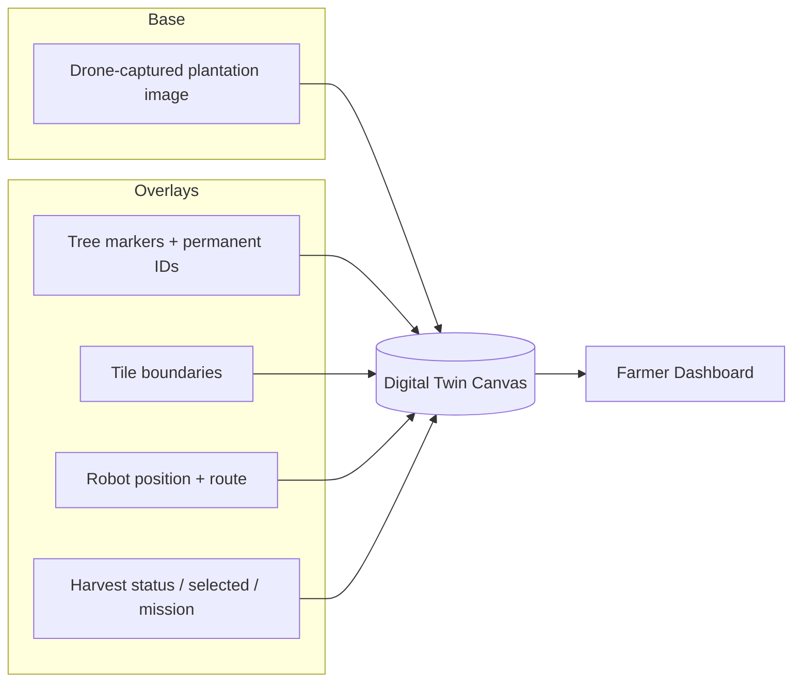
```mermaid
flowchart LR
    subgraph Base
        IMG[Drone-captured plantation image]
    end
    subgraph Overlays
        T[Tree markers + permanent IDs]
        B[Tile boundaries]
        R[Robot position + route]
        S[Harvest status / selected / mission]
    end
    IMG --> Canvas[(Digital Twin Canvas)]
    T --> Canvas
    B --> Canvas
    R --> Canvas
    S --> Canvas
    Canvas --> UI[Farmer Dashboard]
```

## 12.6 Why this is better for farmers and demos

A farmer looking at their own plantation from above, with every tree numbered and
coloured by harvest-readiness, gets immediate situational awareness that a generic
street map cannot provide. For demonstrations, the twin makes the abstract pipeline
concrete: you can *see* trees appear after a survey, *see* the robot's route, and
*see* harvest status change — which communicates the system's value far better than
tables of coordinates.

## 12.7 Future satellite basemap (excluded from v1)

A **satellite basemap** (e.g. Esri World Imagery) may be offered later as an
alternative base layer. It is **intentionally excluded from v1** because it needs
network access, an API/key in some cases, and still lacks per-tree knowledge. The
drone image remains the v1 foundation; the satellite layer is a **Future
Consideration** that would slot in as just another selectable base, not a
restructuring.

*End of Part 2. Sections 13 onward follow in subsequent parts.*

---

# 13. Tree Management

## 13.1 The Tree entity

A **Tree** is the central, permanent domain object of the entire system. It is the
stable handle that every other subsystem reads from or writes to. Physically it
represents one coconut tree in the plantation; logically it is the aggregation point
for that tree's location, availability, lifecycle, inventory, and complete history.

The current baseline already has a minimal `Tree` (`backend/database/models.py`):
`id`, `gps_lat`, `gps_lon`, `detected_time`. The frozen architecture expands it
with availability, lifecycle state, inventory reference, scan/harvest timestamps,
and mission reference (§14). The responsibility of Tree Management is to own that
entity's creation, matching, state transitions, and retention rules.

## 13.2 Why a detected tree is a permanent digital asset

A raw detection is a transient observation: "a model saw something here at this
instant." A Tree is an asset: "this is *the* tree, and everything we learn about it
accumulates here." Promoting every detected tree to a permanent asset is what makes
the farm a durable, queryable record instead of a throwaway list regenerated on each
flight. The cost of keeping a row is negligible; the cost of losing continuity
(history, yield trends, audit) is high. Hence the frozen rule: trees are never
deleted and IDs are never reused.

## 13.3 How Tree connects every subsystem

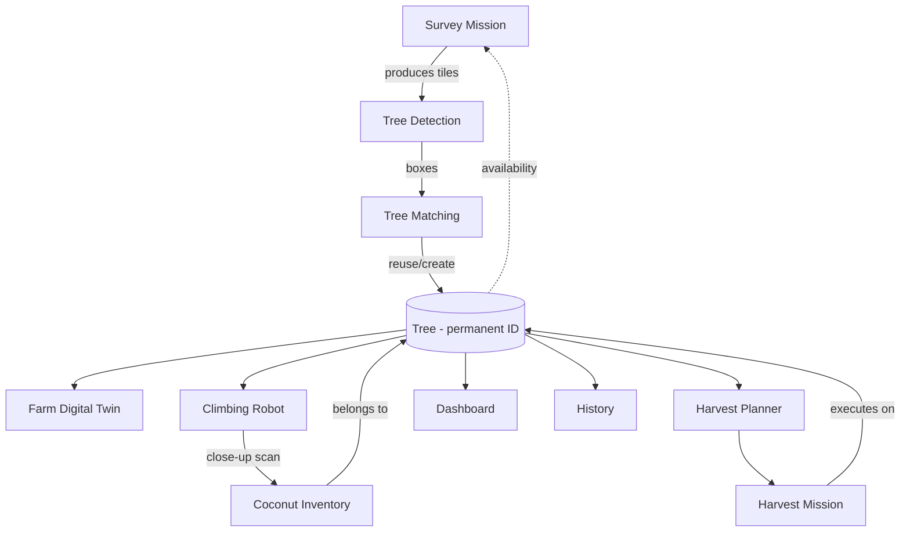
```mermaid
flowchart TD
    SM[Survey Mission] -->|produces tiles| TD[Tree Detection]
    TD -->|boxes| TM[Tree Matching]
    TM -->|reuse/create| TREE[(Tree - permanent ID)]
    TREE --> DT[Farm Digital Twin]
    TREE --> CR[Climbing Robot]
    CR -->|close-up scan| CI[Coconut Inventory]
    CI -->|belongs to| TREE
    TREE --> HP[Harvest Planner]
    HP --> HM[Harvest Mission]
    HM -->|executes on| TREE
    TREE --> DASH[Dashboard]
    TREE --> HIST[History]
    TREE -.->|availability| SM
```

Every arrow terminates or originates at `Tree`. The entity is the hub: surveys feed
it, the robot reads and updates it, planning selects from it, the twin renders it,
history records it. No subsystem owns the tree alone — Tree Management is the
steward that guarantees its invariants (permanent ID, no deletion, stable GPS).

## 13.4 Stable IDs across multiple Survey Missions

Because Tree Matching (§11) reuses an existing permanent ID whenever a new detection
falls within 4 m of it, a tree detected in Survey 1, re-detected in Survey 2's
overlap, and again in Survey 3 keeps the **same** `tree_id`. The ID is assigned once
at first creation and never reassigned. Cross-mission stability is therefore an
emergent property of the proximity rule, not a separate linkage table.

## 13.5 Why IDs are never reused or renumbered

- **Never reused:** if Tree #7 is retired to `INACTIVE`, its ID is not given to a
  later new tree. Reuse would make history queries ambiguous ("did harvest #7
  belong to the old tree or the new one?").
- **Never renumbered:** IDs are primary keys, referenced by foreign keys in
  detections, inventory, tasks, and history. Renumbering would invalidate every
  reference and force a cascading, error-prone rewrite. The ID is an opaque,
  immutable handle.

## 13.6 Why trees are never physically deleted

Deletion would (a) break foreign keys from history/inventory/tasks, (b) erase the
audit trail of what the farm contained, and (c) lose yield and observation data that
may later matter for analytics or dispute. Instead of deletion, a tree is moved to
`MISSING`/`INACTIVE` availability (§16). The database grows monotonically, which is
acceptable and safer than mutable identity.

## 13.7 Every future operation revolves around Tree

Harvest requests filter Trees. The planner orders Trees. The robot visits Trees. The
twin marks Trees. History annotates Trees. A new engineer can therefore understand
the whole system by understanding one entity and its invariants — which is exactly
why the architecture centres on it.

---

# 14. Tree Data Model

The logical `Tree` entity carries the following properties. No SQL is given; these
are the conceptual columns and their owning subsystems.

| Property | Type (logical) | Owner / Updater | Purpose |
|---|---|---|---|
| `tree_id` | integer (PK) | Tree Matching | Permanent, opaque identifier. Assigned once, never reused/renumbered. |
| `gps_lat` / `gps_lon` | float | GPS Generation (§10) | Generated coordinates from base GPS + box/tile. Permanent after creation. |
| `plantation_position` | grid ref (row,col) / index | Tile Processing | Position within the coverage grid; supports spatial queries and the twin. |
| `availability` | enum `ACTIVE`/`MISSING`/`INACTIVE` | Tree Matching / Survey | Is the tree currently observable in the active mission? (§16) |
| `lifecycle_state` | enum (§15) | multiple | Current stage: NEW → HARVESTED → RESCAN_REQUIRED. |
| `current_inventory_id` | FK → Inventory | Climbing Robot | Pointer to the latest inventory snapshot (replaced each scan, §17). |
| `last_survey_ts` | UTC timestamp | Survey Mission | When this tree was last observed in a completed survey. |
| `last_coconut_scan_ts` | UTC timestamp | Climbing Robot | When the robot last ran ripeness detection on it. |
| `last_harvest_ts` | UTC timestamp | Harvest Mission | When it was last harvested. |
| `current_mission_id` | FK → SurveyMission | Survey Mission | Which ACTIVE survey produced/confirmed this tree. |
| `history_refs` | collection | History | Links to survey, harvest, inventory, and status-change records (§18). |

**Notes on ownership.**

- `gps_lat/lon` and `tree_id` are write-once; only Tree Matching may set them, and
  only at creation.
- `availability` is owned by the survey/matching path because it reflects observed
  presence.
- `lifecycle_state` is co-owned: detection sets the early states, the robot and
  planner drive the middle/later states.
- `current_inventory_id` and the scan/harvest timestamps are owned by the climbing
  robot and harvest mission respectively.
- `history_refs` is append-only, written by the History subsystem on every
  transition.

This separation of ownership prevents two subsystems from fighting over a column
and keeps each property's source of truth unambiguous.

---

# 15. Tree Lifecycle

## 15.1 States and transitions

The lifecycle describes a tree's **harvest readiness journey**, independent of
whether it was physically seen this survey (that is availability, §16). The states
are:

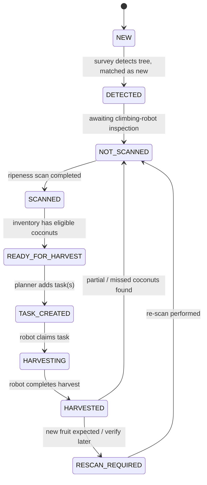
```mermaid
stateDiagram-v2
    [*] --> NEW
    NEW --> DETECTED: survey detects tree, matched as new
    DETECTED --> NOT_SCANNED: awaiting climbing-robot inspection
    NOT_SCANNED --> SCANNED: ripeness scan completed
    SCANNED --> READY_FOR_HARVEST: inventory has eligible coconuts
    READY_FOR_HARVEST --> TASK_CREATED: planner adds task(s)
    TASK_CREATED --> HARVESTING: robot claims task
    HARVESTING --> HARVESTED: robot completes harvest
    HARVESTED --> RESCAN_REQUIRED: new fruit expected / verify later
    RESCAN_REQUIRED --> NOT_SCANNED: re-scan performed
    HARVESTED --> NOT_SCANNED: partial / missed coconuts found
```

## 15.2 Transition detail

| Transition | When | Subsystem | Why it exists | What changes |
|---|---|---|---|---|
| `NEW → DETECTED` | A GPS-proximity match creates a brand-new Tree. | Tree Matching | Marks first-ever sighting; separates "exists" from "known before". | `tree_id` assigned, `gps_*`, `availability=ACTIVE`, `lifecycle=DETECTED`, `last_survey_ts`. |
| `DETECTED → NOT_SCANNED` | Tree is in the farm but not yet inspected for ripeness. | Survey / Tree Mgmt | The drone cannot judge ripeness; an explicit "not yet scanned" state is required before SCANNED. | `lifecycle=NOT_SCANNED`. |
| `NOT_SCANNED → SCANNED` | Climbing robot captures close-up and ripeness model runs. | Climbing Robot | Ripeness is only known after the robot's precision pass. | `lifecycle=SCANNED`, `last_coconut_scan_ts`, `current_inventory_id` set (§17). |
| `SCANNED → READY_FOR_HARVEST` | Inventory contains ≥1 coconut matching the harvest preference. | Harvest Planner (eval) | A scanned tree is not necessarily harvestable; eligibility must be confirmed. | `lifecycle=READY_FOR_HARVEST`. |
| `READY_FOR_HARVEST → TASK_CREATED` | Planner includes the tree in the queue. | Harvest Planner | Links readiness to actionable work; prevents the robot acting on unplanned trees. | `lifecycle=TASK_CREATED`, task row created. |
| `TASK_CREATED → HARVESTING` | Robot claims the task (`in_progress`). | Robot Queue / Robot | Reflects in-progress physical work; matches the robot state machine. | `lifecycle=HARVESTING`, task `claimed_at`. |
| `HARVESTING → HARVESTED` | Robot reports completion. | Robot / Harvest Mission | Terminal success of the current harvest cycle. | `lifecycle=HARVESTED`, `last_harvest_ts`, task `completed`. |
| `HARVESTED → RESCAN_REQUIRED` | System expects regrowth / a later pass. | Harvest Mission | Coconuts mature in waves; the tree will bear again and must be revisited. | `lifecycle=RESCAN_REQUIRED`. |
| `RESCAN_REQUIRED → NOT_SCANNED` | A new ripeness scan is performed. | Climbing Robot | Closes the loop so the tree can re-enter the ready/harvest path. | `lifecycle=NOT_SCANNED` (fresh scan). |
| `HARVESTED → NOT_SCANNED` | Post-harvest check finds un-harvested coconuts. | Climbing Robot | Handles the case where the first pass missed fruit. | `lifecycle=NOT_SCANNED`. |

## 15.3 Worked examples

- **First sighting:** Survey detects a new canopy → `NEW`→`DETECTED`→`NOT_SCANNED`.
  Robot scans → `SCANNED`. Inventory shows 12 mature → `READY_FOR_HARVEST`. Planner
  queues it → `TASK_CREATED`. Robot claims → `HARVESTING` → completes → `HARVESTED`.
- **Regrowth:** After harvest, the tree is `RESCAN_REQUIRED`; next season's scan
  returns it to `NOT_SCANNED` and the cycle repeats.

---

# 16. Tree Availability

## 16.1 Availability vs lifecycle

Availability answers *"can we currently see this tree?"* Lifecycle (§15) answers
*"how ready is it to harvest?"* A tree can be `ACTIVE` but `NOT_SCANNED`, or
`MISSING` but previously `HARVESTED`. The two axes are orthogonal so the system can
reason about presence and readiness independently.

## 16.2 States

| State | Meaning |
|---|---|
| `ACTIVE` | Observed in the latest ACTIVE Survey Mission; the tree is present and locatable. |
| `MISSING` | Not observed in the latest ACTIVE mission, but was `ACTIVE` before. Soft signal — possibly occluded or a failed tile. |
| `INACTIVE` | Not observed across multiple consecutive ACTIVE missions. Presumed gone or permanently unobservable. |

## 16.3 Transition rules

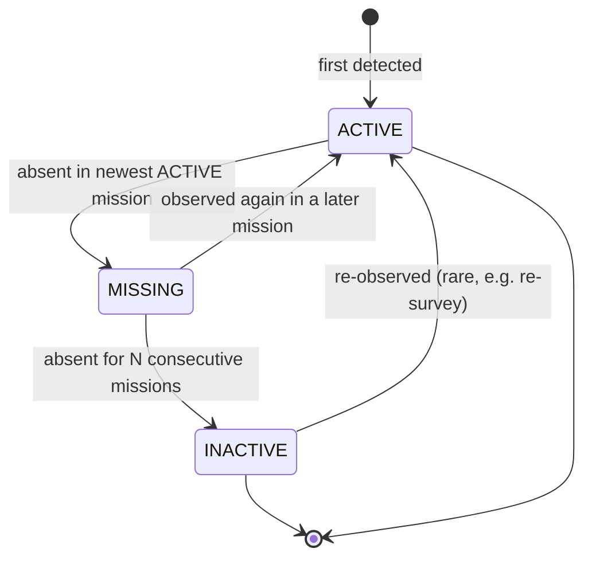
```mermaid
stateDiagram-v2
    [*] --> ACTIVE: first detected
    ACTIVE --> MISSING: absent in newest ACTIVE mission
    MISSING --> ACTIVE: observed again in a later mission
    MISSING --> INACTIVE: absent for N consecutive missions
    INACTIVE --> ACTIVE: re-observed (rare, e.g. re-survey)
    INACTIVE --> [*]
    ACTIVE --> [*]
```

- **Tree found → ACTIVE:** any new or re-matched detection in the active mission.
- **Tree missing in latest mission → MISSING:** presence check after mission
  completion flips unsurveyed active trees.
- **Tree missing across multiple missions → INACTIVE:** a configurable consecutive
  miss count (e.g. 2–3) promotes MISSING to INACTIVE.

## 16.4 Why deletion is avoided

Deleting an `INACTIVE` tree would erase its detections, inventories, harvests, and
history, and would orphan foreign keys. Availability gives the *effect* of removal
(presumed gone, excluded from planning) without the *cost* of destroying data. The
row stays; only its availability flag changes.

## 16.5 Why preserving history matters

A farm's record is longitudinal. Knowing that Tree #5 was harvested three times
before going INACTIVE is useful for yield modelling, insurance, and diagnosing
whether trees are dying in a region. Permanent rows turn the database into a farm
chronicle rather than a snapshot.

---

# 17. Coconut Inventory

## 17.1 Ownership and semantics

Each Tree has exactly **one current Coconut Inventory**, owned by the climbing
robot's ripeness scan. The inventory is the tree's latest observed fruit composition:

- `total_coconuts`
- `mature`
- `premature`
- `immature` (the `Potential` class maps here; see §later ripeness)
- `last_scan_time` (UTC)

*[Implementation note: the current `Detection` table stores per-coconut ripeness
rows (`tree_id`, `coconut_id`, `ripeness`, `confidence`, `harvest_type`) rather than
an aggregated inventory. The aggregated, replace-on-scan `Inventory` entity is a
[Planned Enhancement] that the frozen decision mandates.]*

## 17.2 Replacement, never accumulation

The frozen rule: **inventory always replaces the previous inventory; it is never
accumulated.** After every climbing-robot scan:

1. The old `current_inventory_id` is retired (kept in history, §18).
2. A new Inventory snapshot is written.
3. `Tree.current_inventory_id` points to the new snapshot.
4. `Tree.last_coconut_scan_ts` is updated.

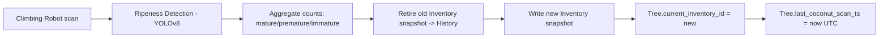
```mermaid
flowchart LR
    A[Climbing Robot scan] --> B[Ripeness Detection - YOLOv8]
    B --> C[Aggregate counts: mature/premature/immature]
    C --> D[Retire old Inventory snapshot -> History]
    D --> E[Write new Inventory snapshot]
    E --> F[Tree.current_inventory_id = new]
    F --> G[Tree.last_coconut_scan_ts = now UTC]
```

## 17.3 Why replacement over incremental updates

- **Physical reality:** a harvest *removes* fruit. Incrementing counts would require
  the robot to report exact deltas, which is error-prone and unverifiable (no
  post-harvest scan, §5). Re-scanning and replacing yields a self-correcting,
  authoritative count.
- **Consistency:** a single "latest state" pointer removes the ambiguity of
  "which partial update is current?". There is exactly one source of truth per
  tree.
- **Simplicity:** no merge logic, no delta reconciliation, no race conditions
  between scans.

## 17.4 How replacement simplifies consistency

Because the current inventory is always a complete snapshot, any reader (planner,
dashboard, twin) needs only `Tree.current_inventory_id` to get a consistent,
point-in-time view. Historical snapshots remain available for trend analysis without
complicating the live path.

---

# 18. Tree History

## 18.1 The history system

History is the append-only record of everything that happened to a Tree and to the
farm. It is immutable: once written, a history row is never edited or deleted. It
exists so the system is auditable and so future analytics can reconstruct past
states.

## 18.2 What Tree history contains

- **Survey History** — every Survey Mission that observed this tree (mission ID,
  timestamp, tile, detected position).
- **Harvest History** — every harvest event (mission ID, timestamps, coconuts
  removed, robot/task reference).
- **Inventory History** — every retired inventory snapshot (counts + scan time), so
  ripeness trends over time are reconstructable.
- **Mission References** — which Survey/Harvest missions touched the tree.
- **Status Changes** — every lifecycle and availability transition with from/to
  state and timestamp.

## 18.3 Why history is immutable

Editing history would make audits untrustworthy and break reproducibility (a past
mission's twin could no longer be rebuilt). Immutability is what turns the log into
evidence. The only "change" permitted is adding a new row; corrections are made by
recording a new transition, not by overwriting.

## 18.4 How history helps future analytics

With immutable history, the system can answer: yield per tree per season, time
between detection and first harvest, ripeness conversion rates (premature→mature
over time), availability decay across the farm, and planner effectiveness. These
are impossible without retained, unmutated records.

## 18.5 Example history tables

**Status-change log (Tree #12)**

| ts (UTC) | from | to | reason |
|---|---|---|---|
| 2026-07-10 09:01 | NEW | DETECTED | survey mission #3 |
| 2026-07-10 09:01 | DETECTED | NOT_SCANNED | post-match |
| 2026-07-11 14:20 | NOT_SCANNED | SCANNED | robot scan |
| 2026-07-11 14:25 | SCANNED | READY_FOR_HARVEST | 10 mature |
| 2026-07-12 10:00 | READY_FOR_HARVEST | TASK_CREATED | planner |
| 2026-07-12 10:05 | TASK_CREATED | HARVESTING | robot claim |
| 2026-07-12 10:12 | HARVESTING | HARVESTED | robot complete |
| 2026-07-12 10:12 | HARVESTED | RESCAN_REQUIRED | post-harvest |

**Inventory history (Tree #12)**

| scan_ts (UTC) | mature | premature | immature | total |
|---|---|---|---|---|
| 2026-07-11 14:20 | 10 | 3 | 1 | 14 |
| 2026-08-20 11:00 | 8 | 2 | 0 | 10 |

---

# 19. Timestamp Strategy

## 19.1 Policy

- **Storage:** all timestamps are stored in **UTC** (`datetime.utcnow()` in the
  current baseline, e.g. `Tree.detected_time`, `Task.created_at`,
  `Task.claimed_at`).
- **Display:** timestamps are presented to the farmer in **Indian Standard Time
  (IST = UTC+05:30)**, converted in the UI layer, never in storage.

## 19.2 Why UTC storage

- **Unambiguous ordering.** A single timezone removes daylight-saving and local
  offset confusion when sorting surveys, tasks, and harvests.
- **Portability.** If the system is later deployed in another region, stored data
  needs no migration; only the display offset changes.
- **Consistency across actors.** The drone, robot simulator, and dashboard may run
  on different clocks; UTC is the common reference that keeps the audit log
  coherent.

## 19.3 Why display in IST

The operator is an Indian farmer. Showing "harvest completed at 15:42 IST" is
directly meaningful; showing "10:12 UTC" forces a mental conversion and invites
error. Display-localisation improves usability without compromising the stored
canonical value.

## 19.4 Events that receive timestamps

| Event | Timestamp field(s) |
|---|---|
| Survey Started | `SurveyMission.created_at` |
| Survey Completed | `SurveyMission.completed_at` |
| Tree Created | `Tree.detected_time` / creation ts |
| Tree Updated | availability / lifecycle change ts (history) |
| Tree Scanned | `Tree.last_coconut_scan_ts` |
| Harvest Started | harvest mission start ts / task `claimed_at` |
| Harvest Completed | harvest mission complete ts / task completion ts |
| Mission Created | `SurveyMission.created_at` |
| Mission Completed | `SurveyMission.completed_at` |
| Task Assigned | `Task.claimed_at` |
| Task Completed | task completion ts |

Every timestamp is written once in UTC and rendered in IST at the edge, so the
database remains the single canonical clock while the farmer sees local time.

*End of Part 3. Sections 20 onward follow in subsequent parts.*

---

# 20. Climbing Robot System

## 20.1 Purpose

The Climbing Robot is the precision actor of the system. Where the drone gives
coarse, farm-wide coverage, the climbing robot gives fine, per-tree inspection and
physical harvesting. It is the only subsystem that touches an individual tree
closely enough to read coconut ripeness reliably.

## 20.2 Responsibilities (and deliberate non-responsibilities)

The robot is responsible **only** for:

- **Climbing assigned trees** — physically ascending the trunk of a tree selected
  by the planner.
- **Capturing close-up coconut images** — a canopy-level photograph of the fruit.
- **Running ripeness detection** — invoking the coconut model on that image.
- **Updating tree inventory** — replacing the tree's inventory with the fresh scan.
- **Executing harvest tasks** — performing the pick for tasks assigned to it.

The robot is **not** responsible for:

- **Navigation planning / route optimization** — owned by the Harvest Planner
  (nearest-neighbour) and Robot Queue.
- **Tree detection** — owned by the drone + Tree Detection subsystem.
- **GPS generation** — owned by the survey/GPS-generation subsystem.

## 20.3 Why responsibilities are separated

- **Single source of truth per concern.** If the robot also planned routes, a bug
  in planning could break harvesting *and* be entangled with actuator logic.
  Splitting keeps each subsystem testable alone.
- **Reuse of the planner.** Route optimization is a generic problem usable by any
  actor; coupling it to the robot would prevent reuse and make the robot's code
  heavier than a student project needs.
- **Hardware swap-in.** Because the robot only consumes a task list and reports
  completion, a real climber can replace the simulator by satisfying the same HTTP
  contract (`GET /robot/next_task`, `POST /robot/complete_task`) without touching
  detection or planning.
- **Correct sensing split.** Tree detection from altitude and coconut detection up
  close use different models and different failure modes; conflating them in one
  "robot brain" would couple two independent ML lifecycles.

## 20.4 Interactions

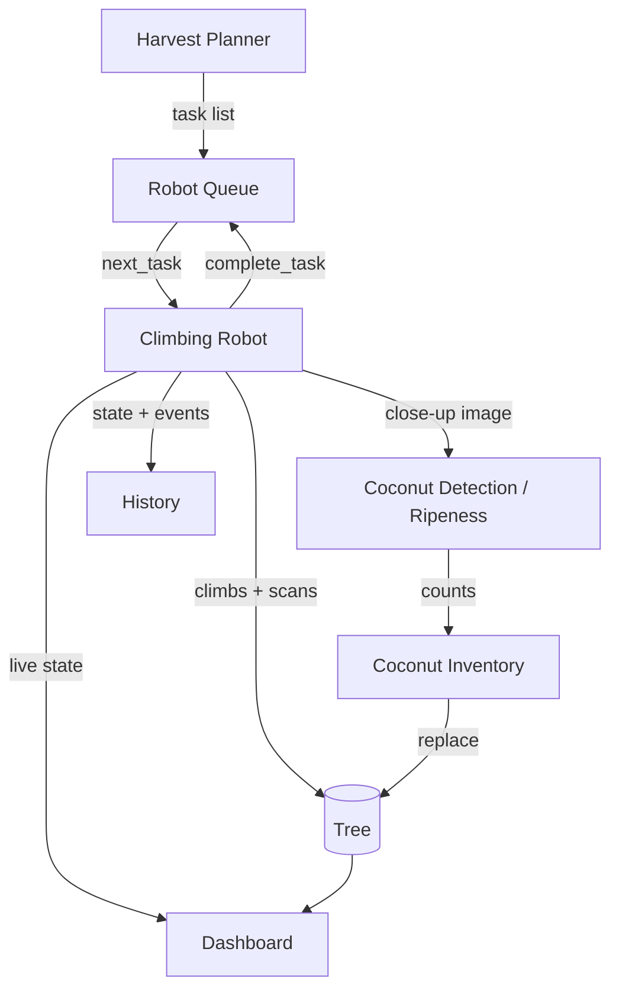
```mermaid
flowchart TD
    HP[Harvest Planner] -->|task list| RQ[Robot Queue]
    RQ -->|next_task| ROB[Climbing Robot]
    ROB -->|climbs + scans| TREE[(Tree)]
    ROB -->|close-up image| CD[Coconut Detection / Ripeness]
    CD -->|counts| INV[Coconut Inventory]
    INV -->|replace| TREE
    ROB -->|complete_task| RQ
    ROB -->|state + events| HIST[History]
    ROB -->|live state| DASH[Dashboard]
    TREE --> DASH
```

- **Tree Management:** the robot reads the assigned `tree_id` and writes inventory,
  scan timestamp, and lifecycle transitions.
- **Dashboard:** reports its current operational state (§26) so the twin can show
  Idle/Moving/Climbing/etc.
- **Harvest Planner:** consumes the planner's output only indirectly, via the queue;
  it does not call the planner directly.
- **Coconut Inventory:** owns the replace-on-scan write (§17, §23).
- **History:** every climb, scan, harvest, and error is appended as an immutable
  record.

## 20.5 Component diagram

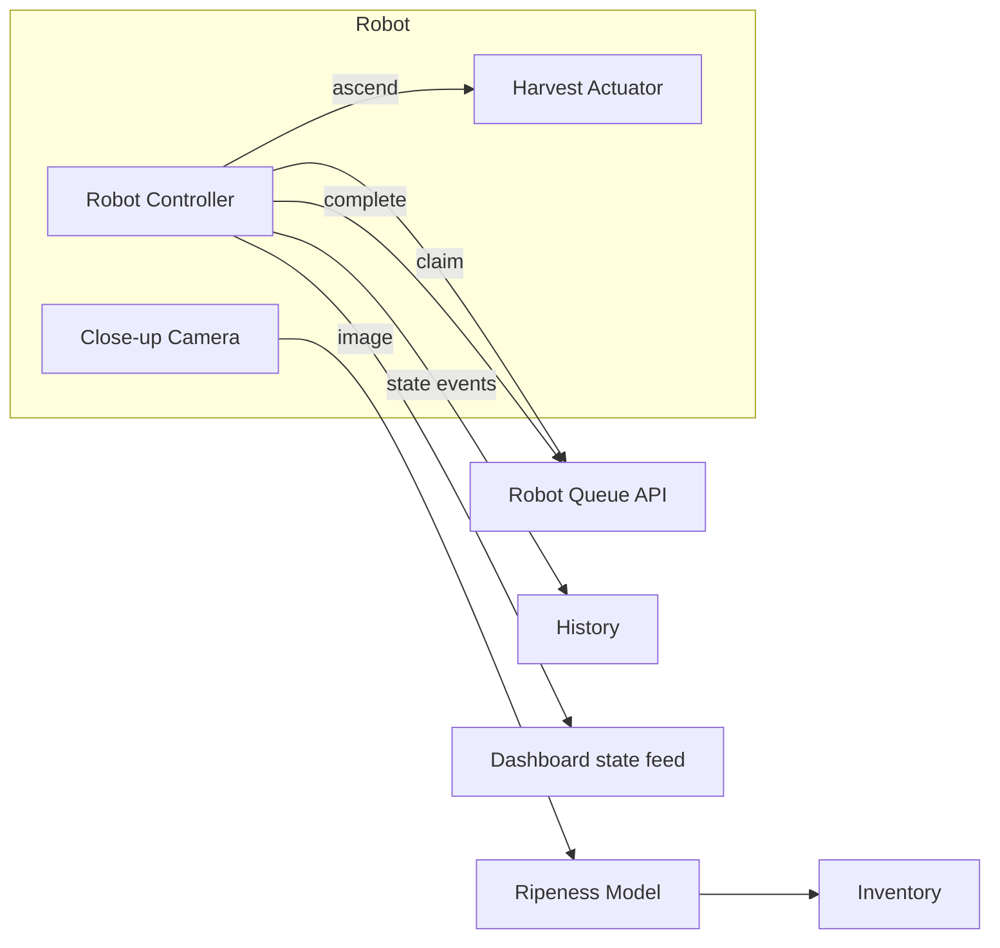
```mermaid
flowchart LR
    subgraph Robot
        CTRL[Robot Controller]
        CAM[Close-up Camera]
        ACT[Harvest Actuator]
    end
    CTRL -->|claim| Q[Robot Queue API]
    CTRL -->|ascend| ACT
    CAM -->|image| CD[Ripeness Model]
    CD --> INV[Inventory]
    CTRL -->|complete| Q
    CTRL -->|state events| HIST[History]
    CTRL --> DASH[Dashboard state feed]
```

---

# 21. Coconut Scan Workflow

## 21.1 Step-by-step

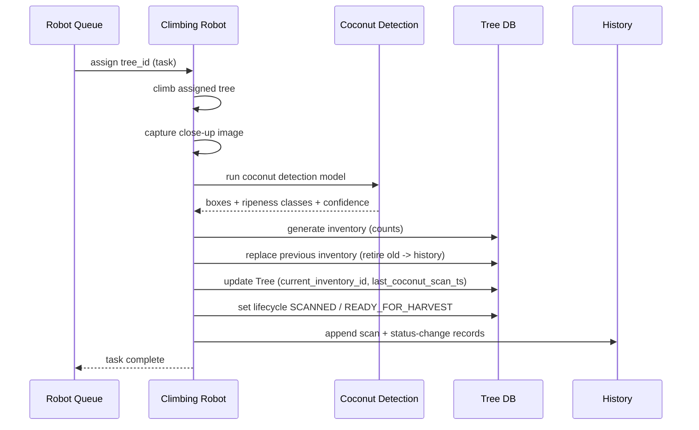
```mermaid
sequenceDiagram
    participant Q as Robot Queue
    participant R as Climbing Robot
    participant CD as Coconut Detection
    participant DB as Tree DB
    participant H as History

    Q->>R: assign tree_id (task)
    R->>R: climb assigned tree
    R->>R: capture close-up image
    R->>CD: run coconut detection model
    CD-->>R: boxes + ripeness classes + confidence
    R->>DB: generate inventory (counts)
    R->>DB: replace previous inventory (retire old -> history)
    R->>DB: update Tree (current_inventory_id, last_coconut_scan_ts)
    R->>DB: set lifecycle SCANNED / READY_FOR_HARVEST
    R->>H: append scan + status-change records
    R-->>Q: task complete
```

1. **Select Tree** — the queue hands the robot a `tree_id` to service.
2. **Robot climbs tree** — physical ascent; the robot transitions to `Climbing`.
3. **Capture close-up image** — a canopy photograph, the only input ripeness
   detection trusts.
4. **Run Coconut Detection Model** — YOLO returns bounding boxes per coconut.
5. **Run Ripeness Classification** — each box is labelled `Mature`/`Premature`/
   `Immature` with confidence.
6. **Generate Inventory** — counts are aggregated (§23).
7. **Replace Previous Inventory** — the old snapshot is retired to history; the new
   one becomes current (§17).
8. **Update Tree** — `current_inventory_id` and `last_coconut_scan_ts` are written;
   lifecycle moves to `SCANNED`, and if eligible, `READY_FOR_HARVEST`.
9. **Update History** — scan event + status changes appended immutably.
10. **Tree becomes READY_FOR_HARVEST** — when inventory contains coconuts matching
    the active harvest preference (§24).

## 21.2 Why inventory replacement

Replacement (not accumulation) is the frozen rule because a harvest removes fruit
and the robot cannot perfectly report deltas; a fresh full scan is self-correcting
and always authoritative. See §17.3 for the full rationale.

## 21.3 Repeated scans stay current

Because every scan writes a *complete* new snapshot and retires the prior one,
repeated scans — whether daily, seasonal, or after a partial harvest — always leave
`Tree.current_inventory_id` pointing at the most recent truth. No stale partial
state can survive, since there is no incremental merge to get wrong.

---

# 22. Coconut Ripeness Detection

## 22.1 Purpose

Ripeness Detection answers "of the coconuts on this tree, how many are mature,
premature, or immature, and how confident are we?" It is the precision counterpart
to Tree Detection and runs exclusively on close-up imagery.

## 22.2 Input and output

- **Input:** one close-up canopy image from the climbing robot.
- **Output:** a list of detections, each with bounding box `(x1,y1,x2,y2)`, a
  ripeness class, and a confidence. The current implementation
  (`backend/api/coconut_api.py`, `models/coconut_model/coconut_detector.pt`) returns
  `ripeness`, `confidence` per coconut and an annotated image.

## 22.3 Current YOLO model

The coconut detector is an Ultralytics YOLOv8 model trained on the
`coconut-maturity-detection` dataset with `nc: 3` and
`names: ['Mature', 'Potential', 'Premature']` (`models/coconut_model/data.yaml`).
`Potential` is treated as the **immature** ripeness class in the inventory model
(§23). The model is loaded once at backend start.

*[Implementation note: ripeness labels arrive capitalised and are stored lowercased
(`detection_api` applies `ripeness.lower()`); queries use `func.lower(...)`. This
normalisation is a frozen invariant.]*

## 22.4 Detection pipeline

1. Decode the close-up image.
2. Run YOLO → boxes + class + confidence.
3. Apply a confidence threshold to drop weak detections.
4. Map class id → ripeness label.
5. Return structured detections (consumed by Inventory generation, §23).

## 22.5 Ripeness classes, confidence, boxes, filtering

- **Classes:** `Mature`, `Premature`, `Immature` (model `Potential`). These three
  drive harvest eligibility (§24).
- **Confidence:** per-box objectness×class probability; used to filter false
  positives before counting.
- **Boxes:** axis-aligned rectangles around individual coconuts.
- **Filtering:** confidence threshold + (inside YOLO) non-maximum suppression so one
  coconut yields one box.

## 22.6 Independence from Tree Detection

Tree Detection and Ripeness Detection are **separate models, separate inputs,
separate failure modes**:

- Tree Detection finds *where a tree is* from altitude; it does not and cannot judge
  fruit ripeness at that zoom.
- Ripeness Detection finds *what the fruit is* from close-up; it assumes the tree is
  already located and climbed.

Keeping them apart means each model is trained, versioned, and replaced
independently. A better ripeness model can ship without touching tree detection; a
different drone altitude for surveys does not force a ripeness retrain. This
modularity is exactly why the frozen architecture rejects a single combined model
(§2, §5).

---

# 23. Coconut Inventory Generation

## 23.1 From detections to inventory

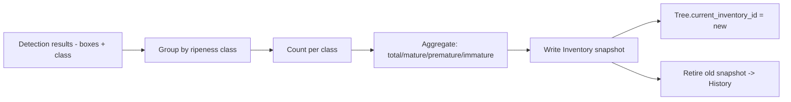
```mermaid
flowchart LR
    A[Detection results - boxes + class] --> B[Group by ripeness class]
    B --> C[Count per class]
    C --> D[Aggregate: total/mature/premature/immature]
    D --> E[Write Inventory snapshot]
    E --> F[Tree.current_inventory_id = new]
    E --> G[Retire old snapshot -> History]
```

1. **Detection results** — list of `(box, class, confidence)` from §22.
2. **Grouping** — partition detections by ripeness class.
3. **Counting** — tally `mature`, `premature`, `immature`.
4. **Inventory** — assemble `total_coconuts`, `mature`, `premature`, `immature`,
   `last_scan_time` (UTC).

## 23.2 Inventory contents

| Field | Meaning |
|---|---|
| `total_coconuts` | All detected coconuts on the tree. |
| `mature` | Count of `Mature` class. |
| `premature` | Count of `Premature` class. |
| `immature` | Count of `Immature` (model `Potential`) class. |
| `last_scan_time` | UTC timestamp of this scan. |

## 23.3 Only latest is current; previous stay in history

`Tree.current_inventory_id` points at exactly one snapshot — the latest. Prior
snapshots are not deleted; they are retired into Inventory History (§18) so ripeness
trends over time remain queryable. This gives the live path a single source of truth
while preserving the analytical record, with no merge logic (§17.4).

---

# 24. Harvest Eligibility

## 24.1 Rules

A tree becomes eligible for harvest only if **all** hold:

1. The Tree **exists** (permanent ID present).
2. The Tree has been **scanned** (`lifecycle >= SCANNED`, i.e. an inventory exists).
3. An **inventory exists** (`current_inventory_id` is set).
4. The **requested coconut type is present** in that inventory.

## 24.2 Per-preference eligibility

| Harvest request | Eligibility condition |
|---|---|
| **Mature** | `inventory.mature > 0` |
| **Premature (Tender)** | `inventory.premature > 0` |
| **All / Both** | any inventory exists (`total_coconuts > 0`) |

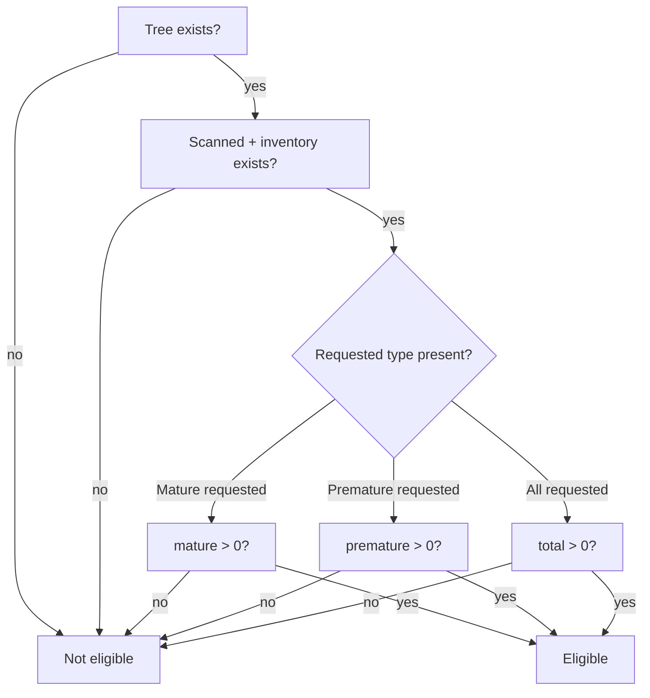
```mermaid
flowchart TD
    A[Tree exists?] -->|no| X[Not eligible]
    A -->|yes| B[Scanned + inventory exists?]
    B -->|no| X
    B -->|yes| C{Requested type present?}
    C -->|Mature requested| D[mature > 0?]
    C -->|Premature requested| E[premature > 0?]
    C -->|All requested| F[total > 0?]
    D -->|yes| G[Eligible]
    E -->|yes| G
    F -->|yes| G
    D -->|no| X
    E -->|no| X
    F -->|no| X
```

## 24.3 Examples

- **Harvest Mature:** Tree #12 has `mature=10, premature=3` → eligible. Tree #13 has
  `mature=0, premature=5` → not eligible for a Mature request.
- **Harvest Premature:** Tree #13 (`premature=5`) → eligible; Tree #12 still eligible
  too (it also has premature). Tree with `mature=0, premature=0, immature=2` → not
  eligible for either Mature or Premature.
- **Harvest All:** any tree with `total_coconuts > 0` → eligible.

Eligibility is evaluated by the planner (§later) against these rules; the robot only
ever receives already-eligible tasks.

---

# 25. Inventory Refresh Strategy

## 25.1 Post-harvest behaviour (v1 decision)

After the robot completes a harvest task, v1 does **not** take a verification image.
Instead:

```
Robot completes harvest
  -> Inventory automatically updated (counts reduced / regenerated)
  -> Harvest History recorded
  -> Tree enters RESCAN_REQUIRED
```

The "automatic inventory update" is the frozen rule that the robot's reported
completion triggers an inventory revision (in practice, v1 may set the inventory to
reflect harvested state or flag it for the next scan). The key point: there is no
second camera pass to confirm emptiness.

## 25.2 Why verification scans were excluded

- **Cost/benefit:** a verification pass doubles robot work per tree for marginal
  gain at student-project scope, especially since harvesting is assumed trustworthy
  (§5 out-of-scope item).
- **Simplicity of demo:** skipping the verify loop removes a whole state branch
  (verify→pass/fail→re-harvest) and keeps the robot state machine (§26) and mission
  lifecycle cleaner.
- **No hardware justification:** without a real manipulator whose grasp can fail,
  simulating a verification failure mode adds complexity with no demonstrated need.

## 25.3 Future verification scans

A **Future Consideration**: later versions *may* add an optional post-harvest
close-up to confirm removal. It would be an additive branch, not a restructuring —
the same scan/inventory pipeline (§21, §23) is reused, merely triggered a second
time.

---

# 26. Robot Operational States

## 26.1 States

| State | Entry | Exit | Responsibility |
|---|---|---|---|
| `Idle` | queue empty / between tasks | task assigned | Wait; report availability to dashboard. |
| `Moving` | task assigned | arrive at tree base | Travel to the assigned tree (navigation is external; robot just reports movement). |
| `Climbing` | at tree base | reached canopy | Ascend trunk; secure position. |
| `Scanning` | at canopy, pre-harvest or re-scan | scan done | Capture close-up; run ripeness detection; update inventory. |
| `Harvesting` | scan eligible / task active | harvest done | Execute the pick for assigned coconuts. |
| `Returning` | harvest/scan done | at depot/base | Descend and return; ready for next task. |
| `Error` | any failure (capture/detect/comm) | recovered/reset | Halt safely; report error; await operator or auto-retry. |

## 26.2 Allowed transitions

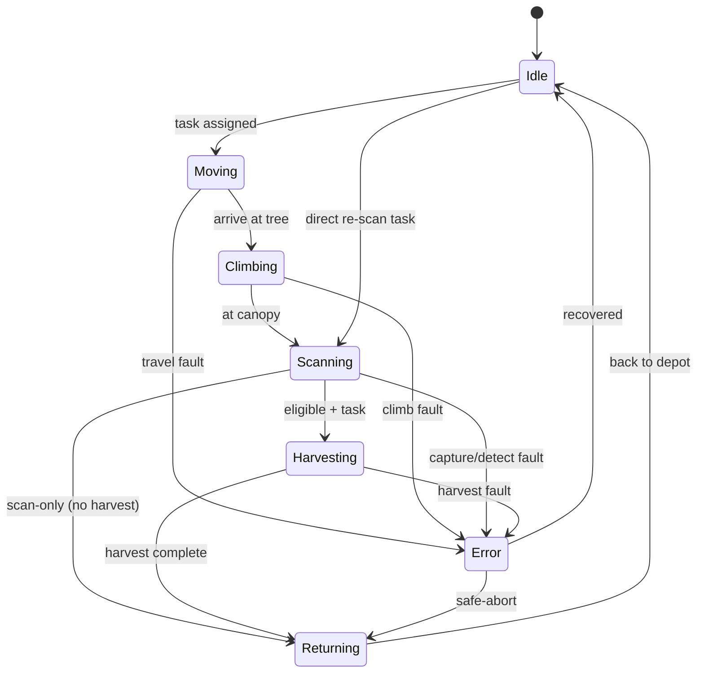
```mermaid
stateDiagram-v2
    [*] --> Idle
    Idle --> Moving: task assigned
    Moving --> Climbing: arrive at tree
    Climbing --> Scanning: at canopy
    Scanning --> Harvesting: eligible + task
    Scanning --> Returning: scan-only (no harvest)
    Harvesting --> Returning: harvest complete
    Returning --> Idle: back to depot
    Idle --> Scanning: direct re-scan task
    Moving --> Error: travel fault
    Climbing --> Error: climb fault
    Scanning --> Error: capture/detect fault
    Harvesting --> Error: harvest fault
    Error --> Idle: recovered
    Error --> Returning: safe-abort
```

`Error` is reachable from any active state and always resolves to either `Idle`
(recover) or `Returning` (safe abort) — it never silently stays stuck.

## 26.3 Why these states improve dashboard visualisation

Each state is a single enumerated value the robot publishes. The digital twin can
render the robot icon with a colour/label per state (Idle=grey, Moving=blue,
Climbing=orange, Scanning=cyan, Harvesting=green, Returning=purple, Error=red). The
farmer sees, at a glance, not just *where* the robot is but *what it is doing*, which
is far more actionable than a bare position dot and directly supports supervision
(§12).

---

# 27. Error Handling

## 27.1 Error catalogue (robot scope)

| Error | Cause (in-scope) | Expected behaviour |
|---|---|---|
| **Image capture failure** | camera returns no/blank frame | Transition to `Error`; retry capture N times; on exhaustion, `Returning` + log. |
| **Detection failure** | model errors / no boxes returned | `Error`; re-run once; if still failing, record a scan attempt with zero counts (do not invent coconuts) and `Returning`. |
| **No coconuts detected** | genuine empty canopy | Not an error — record inventory `total=0`, set appropriate lifecycle, `Returning`. |
| **Invalid tree** | `tree_id` not found / `INACTIVE` | Reject task; report to queue; queue skips to next eligible tree. |
| **Mission cancelled** | harvest mission cancelled mid-run | Robot abandons current task gracefully → `Returning`/`Idle`; no partial writes. |
| **Communication timeout** | `next_task`/`complete_task` HTTP fails | Treat as transient; retry with backoff; if `complete_task` lost, the queue's stale-task reclamation (5-min threshold) releases the task so it is retried — no double-harvest. |

## 27.2 Recovery strategy

- **Retry with bound.** Transient faults (capture, comms) retry a fixed number of
  times before escalating to `Error`/`Returning`.
- **Never fabricate data.** A failed detection yields zero or explicitly-flagged
  counts; the system prefers "unknown" over a wrong inventory.
- **Graceful abort.** Cancellation and unrecoverable faults move the robot to a safe
  state (`Returning`/`Idle`), never leaving it wedged in `Harvesting`/`Climbing`.
- **Stale-task safety.** The existing 5-minute `STUCK_TASK_THRESHOLD`
  (`backend/api/robot_api.py`) reclaims `in_progress` tasks whose `claimed_at` is too
  old, so a crashed robot cannot block a tree forever and a recovered robot cannot
  double-complete.

## 27.3 Out-of-scope

Hardware-specific failures (motor stall, battery depletion, mechanical jam) are not
modelled here; they are subsumed by the generic `Error` state and safe-abort
behaviour. The contract (report `Error`, then `Returning`/`Idle`) is what the real
hardware must satisfy.

*End of Part 4. Sections 28 onward follow in subsequent parts.*

---

# 28. Farmer Dashboard

## 28.1 Purpose

The Farmer Dashboard is the single operator surface of the system. It is where the
farmer triggers surveys, watches the digital twin fill in, requests harvests, and
supervises the robot — without touching APIs, models, or the database directly.

## 28.2 Responsibilities

The dashboard is **presentation only** (a frozen convention from AGENTS.md / the
repo conventions): it renders data from the backend and sends user intent as API
calls. It contains no business logic — eligibility, planning, matching, and state
transitions all live in the backend. This keeps the rules single-sourced and
prevents UI/backend divergence.

## 28.3 Interaction with every subsystem

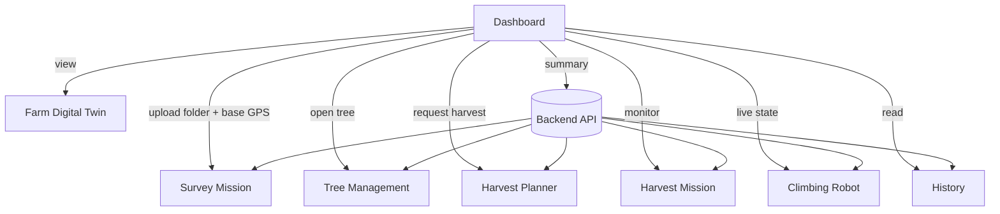
```mermaid
flowchart TD
    DASH[Dashboard] -->|upload folder + base GPS| SM[Survey Mission]
    DASH -->|view| DT[Farm Digital Twin]
    DASH -->|open tree| TM[Tree Management]
    DASH -->|request harvest| HP[Harvest Planner]
    DASH -->|monitor| HM[Harvest Mission]
    DASH -->|live state| RB[Climbing Robot]
    DASH -->|read| HIST[History]
    DASH -->|summary| DB[(Backend API)]
    DB --> SM
    DB --> TM
    DB --> HP
    DB --> HM
    DB --> RB
    DB --> HIST
```

The dashboard consumes read endpoints (summaries, map data, history) and issues
command endpoints (create mission, request harvest, pause/resume/cancel mission).

## 28.4 Centralised information

All important information is on one dashboard because the farmer operates the *whole
farm*, not isolated features. Splitting survey, planning, and monitoring across
separate apps would force constant context-switching and hide the cause/effect
between "I surveyed" and "trees are ready" and "the robot is harvesting". A single
pane makes the pipeline legible and the system demoable end-to-end.

## 28.5 High-level dashboard component diagram

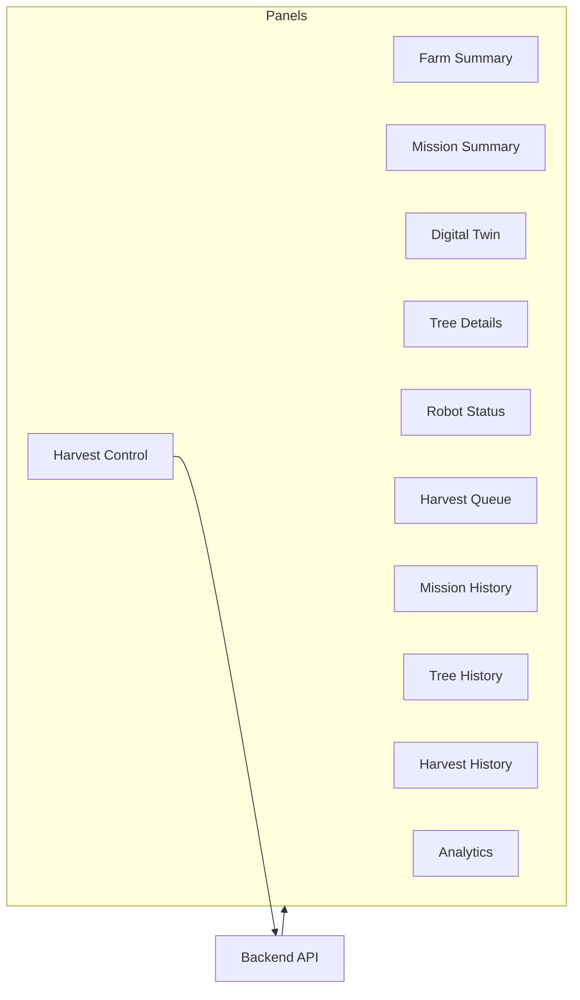
```mermaid
flowchart LR
    subgraph Panels
        FS[Farm Summary]
        MS[Mission Summary]
        TW[Digital Twin]
        TD[Tree Details]
        RC[Robot Status]
        HC[Harvest Control]
        RQ[Harvest Queue]
        MH[Mission History]
        TH[Tree History]
        HH[Harvest History]
        AN[Analytics]
    end
    API[Backend API] --> Panels
    HC --> API
```

---

# 29. Dashboard Layout

## 29.1 Sections (in order)

1. **Top Navigation** — links to Dashboard, Map/Twin, Robot, Missions, History.
2. **Farm Summary Cards** — headline counts (§30).
3. **Survey Mission Panel** — upload control + current/last mission status.
4. **Farm Digital Twin** — the map canvas (§31).
5. **Tree Information Panel** — details of the selected tree (§32).
6. **Harvest Control Panel** — request/pause/resume/cancel (§35).
7. **Robot Status Panel** — live robot state (§26).
8. **Harvest Queue Panel** — ordered pending/in-progress tasks.
9. **Mission History Panel** — past survey missions (§34).
10. **Activity Timeline** — recent events across subsystems (§33).

## 29.2 Why this order

The layout follows the **operator's mental flow**: first understand the farm's
state (summary), then acquire data (survey), then see it spatially (twin), drill
into a tree, decide and launch work (harvest control), watch the actor (robot +
queue), and finally review the record (history + timeline). Reading top-to-bottom
mirrors survey → plan → execute → review.

## 29.3 UI wireframe (Markdown)

```
+------------------------------------------------------------------+
|  Nav: Dashboard | Map | Robot | Missions | History               |
+----------------------+-----------------------------------+------+
| FARM SUMMARY CARDS   |  SURVEY MISSION PANEL              |      |
| Total 142 Active 130 |  [Upload Folder] Base GPS: __     |      |
| Ready 24 Harvested 8 |  Current: Mission #5 ACTIVE       |      |
| Pending 24 Robot Idle|  Last: Mission #4 SUPERSEDED      |      |
+----------------------+-----------------------------------+      |
|  FARM DIGITAL TWIN (drone image + tree markers + robot + route) |      |
|  [ click a tree -> Tree Information Panel ]                     |      |
+----------------------+-----------------------------------+------+
| TREE INFO PANEL      |  HARVEST CONTROL                  | ROBOT|
| Tree #12             |  Scope: ( ) Whole ( ) Selected    | Idle|
| GPS 12.9716,77.5946  |  Type: Mature / Premature / All   |      |
| State READY          |  [Generate Plan][Pause][Resume]   | QUEUE|
| Mature 10 Premature 3|  [Cancel]                         | #12 |
| Last scan 14:20 IST  |                                   | #31 |
+----------------------+-----------------------------------+------+
| MISSION HISTORY (table) | ACTIVITY TIMELINE (event feed)    |
| #5 ACTIVE  #4 SUPERSEDED| 14:20 scan #12  14:25 ready #12   |
+------------------------------------------------------------------+
```

---

# 30. Farm Summary

## 30.1 Metrics and origins

| Metric | Origin (subsystem) |
|---|---|
| Total Trees | `Tree` count (Tree Management). |
| Active Trees | `Tree` where `availability=ACTIVE`. |
| Missing Trees | `availability=MISSING`. |
| Inactive Trees | `availability=INACTIVE`. |
| Scanned Trees | `lifecycle >= SCANNED` (inventory exists). |
| Not Scanned Trees | `lifecycle = NOT_SCANNED`. |
| Ready For Harvest | `lifecycle = READY_FOR_HARVEST`. |
| Harvested Today | Harvest History rows with completion ts today (IST). |
| Pending Harvest Tasks | `Task.status = pending`. |
| Completed Tasks | `Task.status = completed`. |
| Robot Status | Robot operational state (§26). |
| Current Survey Mission | `SurveyMission` with `is_active=true`. |
| Current Harvest Mission | `HarvestMission` with `status=RUNNING`. |

## 30.2 Update frequency

Summary cards are recomputed on dashboard load and refreshed on an interval (e.g.
polling every few seconds) or on explicit user action. Live elements (robot state,
pending tasks) refresh more often; static aggregates (total trees) on load. The
dashboard never caches business logic — it re-reads the backend so the numbers
always reflect current truth.

---

# 31. Farm Digital Twin (user perspective)

## 31.1 Visual elements

| Element | Meaning |
|---|---|
| **Drone image background** | The surveyed plantation, georeferenced (§12). |
| **Tree markers** | One marker per permanent Tree, coloured by availability/lifecycle. |
| **Permanent IDs** | Marker label shows `tree_id`; clicking opens Tree Details (§32). |
| **Tile boundaries** | Outlines of surveyed tiles; show coverage/overlap. |
| **Robot position** | The robot icon at its current tree/position. |
| **Robot route** | Polyline of the planned nearest-neighbour order. |
| **Selected Tree** | Highlight ring on the opened tree. |
| **Harvest indicators** | Per-tree icon/colour for ready/harvesting/harvested. |
| **Mission progress** | Tile-shading or a bar reflecting processed tiles in the active mission. |

## 31.2 Interaction

- **Click a tree** → opens Tree Details Panel (§32) and selects it on the twin.
- **Hover a tree** → popup with `tree_id`, counts, lifecycle (lightweight, no
  navigation).
- **Select** → persists selection so Harvest Control can target "Selected Trees"
  (§35) and the detail panel stays in sync.

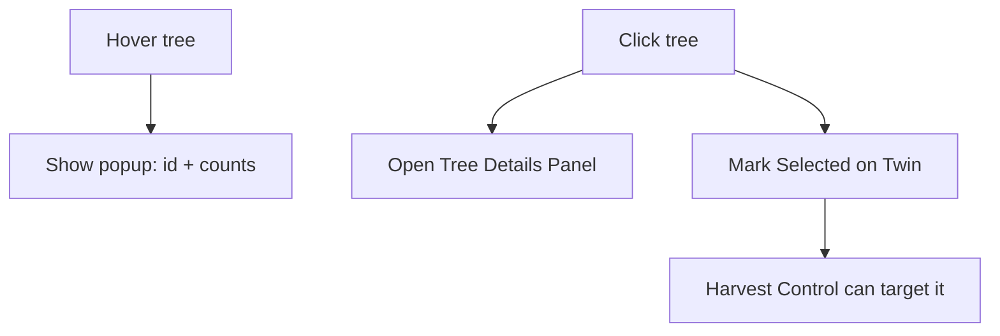
```mermaid
flowchart TD
    A[Hover tree] --> B[Show popup: id + counts]
    C[Click tree] --> D[Open Tree Details Panel]
    C --> E[Mark Selected on Twin]
    E --> F[Harvest Control can target it]
```

## 31.3 Why these elements

They translate the abstract data model into farmer-intuitive visuals: a marker *is*
a tree, a colour *is* its state, a line *is* the robot's plan. This is what makes the
system usable by a non-engineer and demonstrable in one screen.

---

# 32. Tree Details Panel

## 32.1 Fields shown when a tree is selected

| Field | Meaning / source |
|---|---|
| Tree ID | Permanent `tree_id` (Tree Management). |
| GPS Coordinates | `gps_lat`/`gps_lon` (GPS Generation). |
| Availability | `ACTIVE`/`MISSING`/`INACTIVE` (§16). |
| Lifecycle State | current lifecycle enum (§15). |
| Total Coconuts | `inventory.total_coconuts`. |
| Mature | `inventory.mature`. |
| Premature | `inventory.premature`. |
| Immature | `inventory.immature`. |
| Last Survey Scan | `last_survey_ts` (UTC→IST). |
| Last Coconut Scan | `last_coconut_scan_ts` (UTC→IST). |
| Last Harvest | `last_harvest_ts` (UTC→IST). |
| Current Harvest Status | task/mission status for this tree. |
| Current Mission | referencing Survey or Harvest mission ID. |

## 32.2 Actions available

- **Request harvest for this tree** — adds it to a Selected-Trees harvest request
  (§35).
- **View history** — opens the tree's Survey/Inventory/Harvest/Status history (§33).
- **Locate on twin** — pans/highlights the marker.
- **(Future) Trigger re-scan** — request a fresh robot scan [Future Consideration].

Every action is a backend call; the panel holds no logic of its own.

---

# 33. Tree History

## 33.1 History shown to the farmer

- **Survey History** — missions that observed this tree (id, date, tile, position).
- **Inventory History** — retired snapshots with counts + scan time (§18, §23).
- **Harvest History** — harvest events (mission, timestamps, removed counts).
- **Mission References** — which survey/harvest missions touched it.
- **Status Changes** — lifecycle + availability transitions with from/to + ts.

## 33.2 Tables

**Inventory history (Tree #12)**

| scan_ts (IST) | mature | premature | immature | total |
|---|---|---|---|---|
| 2026-07-11 14:20 | 10 | 3 | 1 | 14 |
| 2026-08-20 11:00 | 8 | 2 | 0 | 10 |

**Status changes (Tree #12)**

| ts (IST) | from | to | reason |
|---|---|---|---|
| 2026-07-10 14:31 | NEW | DETECTED | survey #3 |
| 2026-07-12 15:35 | HARVESTING | HARVESTED | robot complete |

## 33.3 Sorting, filtering, timestamps

- **Sorting:** newest-first by default (most relevant), with toggle to oldest.
- **Filtering:** by history type (survey/inventory/harvest/status) so a long record
  stays navigable.
- **Timestamps:** displayed in IST (§19); raw UTC retained internally for ordering.

---

# 34. Survey Mission History

## 34.1 Columns

| Column | Meaning |
|---|---|
| Mission ID | `SurveyMission.id`. |
| Mission Date | `created_at` (IST). |
| Number of Tiles | `tile_count`. |
| Trees Found | trees observed in this mission. |
| Trees Added | new permanent IDs created by this mission. |
| Trees Updated | existing trees re-observed (matched). |
| Mission Duration | `completed_at − created_at`. |
| Mission Status | `ACTIVE` / `SUPERSEDED` / `COMPLETED` / `CANCELLED` (a completed or cancelled mission is retained read-only). |

## 34.2 Why missions stay immutable

Immutability (§7.11) means a mission's statistics never change after completion, so
historical comparison is trustworthy: "Mission #4 found 130 trees, added 12" remains
true forever even after #5 supersedes it.

## 34.3 Comparison between missions

Because each mission records `Trees Added` / `Trees Updated` / totals, the farmer can
compare surveys: e.g. #5 added 3 new trees and marked 2 as MISSING versus #4. This
is how plantation growth and loss become visible — only possible because old
missions are retained, not deleted.

---

# 35. Harvest Control

## 35.1 Operations

| Operation | Behaviour |
|---|---|
| **Entire Plantation** | Harvest request scope = all eligible trees in the farm. |
| **Selected Trees** | Scope = trees the farmer selected on the twin/details (§31, §32). |
| **Harvest Type: Mature** | Eligibility requires `mature > 0` (§24). |
| **Harvest Type: Premature** | Eligibility requires `premature > 0`. |
| **Harvest Type: All** | Any tree with inventory is eligible. |
| **Generate Harvest Plan** | Calls the planner; produces an ordered queue (§later). |
| **Pause Mission** | Harvest Mission → `PAUSED`; robot finishes current task then holds. |
| **Resume Mission** | `PAUSED` → `RUNNING`; robot continues the queue. |
| **Cancel Mission** | `RUNNING`/`PAUSED` → `CANCELLED`; robot safe-aborts (§27). |

```mermaid
flowchart TD
    A[Farmer: choose scope + type] --> B[Generate Harvest Plan]
    B --> C[Planner filters eligible trees]
    C --> D[Order via nearest-neighbour]
    D --> E[Robot Queue built]
    E --> F[Harvest Mission RUNNING]
    F -->|Pause| G[PAUSED]
    G -->|Resume| F
    F -->|Cancel| H[CANCELLED - robot safe-abort]
```

## 35.2 Expected behaviour

- Selecting **Entire Plantation + Mature** yields a queue of every tree with mature
  coconuts, ordered by route.
- **Pause** does not lose progress: completed tasks stay completed; the robot holds
  after its current tree.
- **Cancel** stops new task assignment and lets the robot return safely; already
  harvested trees are recorded.

---

# 36. Harvest Mission Monitoring

## 36.1 Live panel contents

| Element | Source |
|---|---|
| Mission Status | `HarvestMission.status` (CREATED/RUNNING/PAUSED/COMPLETED/CANCELLED). |
| Current Robot State | robot operational state (§26). |
| Current Tree | `tree_id` of the in-progress task. |
| Remaining Trees | queue length (pending + in_progress). |
| Completed Trees | count of completed tasks for this mission. |
| Remaining Tasks | pending task count. |
| Estimated Completion | derived from avg task duration × remaining (simple, not predictive ML). |
| Robot Progress | completed / total for the mission. |
| Mission Timeline | event log of the mission's state changes. |

## 36.2 Update behaviour

The panel polls the backend on a short interval (e.g. every 2–5 s) so robot state and
counts stay live without manual refresh. Status refresh is pull-based: the dashboard
requests current state; it never computes it. Estimated Completion is a transparent
arithmetic projection (remaining × mean duration), explicitly **not** a trained
predictor, keeping analytics honest and explainable (§37).

---

# 37. Dashboard Analytics

## 37.1 Analytics (simple, descriptive only)

All analytics are **descriptive aggregates**, not ML forecasts — the frozen non-goal
is "avoid AI-generated predictions."

- **Trees scanned today** — count of `last_coconut_scan_ts` = today (IST).
- **Trees awaiting scan** — `lifecycle = NOT_SCANNED`.
- **Trees ready for harvest** — `lifecycle = READY_FOR_HARVEST`.
- **Most productive trees** — ranked by cumulative harvested count from Harvest
  History.
- **Harvest counts** — total coconuts harvested per day / per mission.
- **Mission statistics** — per survey mission: tiles, trees found/added/updated,
  duration.
- **Robot utilization** — fraction of time in `Harvesting`/`Moving` vs `Idle` over a
  window (from state history).
- **Survey statistics** — number of missions, total trees across all time, active
  vs missing/inactive split.

## 37.2 Why kept simple

These are directly computable from the retained history (§18) with basic SQL
aggregates. They give the farmer operational insight (where is work pending, which
trees pay off, how busy is the robot) without introducing a prediction model that
would need training data, validation, and explainability work outside the project's
scope.

*End of Part 5. Sections 38 onward follow in subsequent parts.*

---

# 38. Harvest Planning System

## 38.1 Purpose

The Harvest Planning System turns the farmer's intent ("harvest mature coconuts
from the whole farm" or "from these selected trees") into an executable, ordered
list of robot tasks wrapped in a Harvest Mission. It is the bridge between the
farm's observed state (trees + inventory) and the robot's physical work.

## 38.2 Responsibilities (and non-responsibilities)

The planner is responsible **only** for:

- **Selecting eligible trees** — applying the eligibility rules (§40).
- **Filtering inventory** — reading each eligible tree's current inventory to
  confirm the requested coconut type is present.
- **Optimizing execution order** — arranging the selected trees into a route
  (nearest-neighbour, §41).
- **Creating robot tasks** — emitting one `Task` per eligible tree into the queue.

The planner is **not** responsible for:

- **Tree detection** — drone + Tree Detection own that.
- **Coconut detection** — the climbing robot + Ripeness Detection own that.
- **GPS generation** — survey/GPS subsystem owns that.
- **Robot movement** — route *ordering* is planned; physical driving is the robot's
  concern.
- **Robot hardware** — the planner emits tasks; it does not actuate.

## 38.3 Why separated

- **Single source of truth for eligibility.** If the robot also decided eligibility,
  the dashboard and the robot could disagree about what should be harvested. Keeping
  the rule in the planner means every consumer (dashboard, queue, robot) sees the
  same decision.
- **Reusable ordering.** Route optimization is generic; the same nearest-neighbour
  step serves any scope (whole farm or selection) and any actor.
- **Testability.** Eligibility + ordering are pure functions over the tree/inventory
  data; they can be unit-tested without a robot or a camera.
- **Hardware independence.** Because the planner only writes tasks, a real robot
  drops in by consuming the queue, with no planner changes.

## 38.4 Interactions

```mermaid
flowchart TD
    DASH[Farmer Dashboard] -->|request: scope + type| PL[Harvest Planner]
    PL -->|read eligible trees| TM[Tree Management]
    PL -->|read inventory| INV[Coconut Inventory]
    PL -->|create tasks| RQ[Robot Queue]
    RQ -->|executed by| HM[Harvest Mission]
    HM -->|drive| RC[Robot Controller]
    PL -->|mission created| HM
```

- **Dashboard:** receives the request, gets back a plan confirmation.
- **Tree Management:** read-only source of trees, availability, lifecycle.
- **Coconut Inventory:** read-only source of current counts per tree.
- **Robot Queue:** the planner's output sink.
- **Harvest Mission:** the planner instantiates one mission per request.
- **Robot Controller:** consumes the queue; the planner never talks to it directly.

## 38.5 Architecture diagram

```mermaid
flowchart LR
    subgraph Inputs
        REQ[Harvest Request: scope, type]
        TREES[(Trees + availability + lifecycle)]
        INVS[(Inventories)]
    end
    PL[Planner] --> F[Filter eligible]
    F --> O[Order: nearest-neighbour]
    O --> C[Create Tasks]
    C --> Q[(Robot Queue)]
    Q --> M[Harvest Mission]
```

---

# 39. Harvest Request Workflow

## 39.1 Step-by-step

```mermaid
sequenceDiagram
    participant F as Farmer
    participant D as Dashboard
    participant P as Planner
    participant T as Tree/Inventory
    participant Q as Robot Queue
    participant M as Harvest Mission

    F->>D: open dashboard, choose scope + type
    D->>P: Generate Harvest Plan (scope, type)
    P->>T: validate request (read trees + inventories)
    T-->>P: candidate trees + counts
    P->>P: select eligible trees (Sec 40)
    P->>P: order via nearest-neighbour (Sec 41)
    P->>Q: create robot tasks (ordered)
    P->>M: create Harvest Mission (RUNNING)
    M-->>D: mission + queue summary
    D-->>F: dashboard updated
```

1. **Farmer opens dashboard, chooses scope** — Entire Plantation or Selected Trees
   (selected on the twin / detail panel).
2. **Chooses Harvest Type** — Mature / Premature / All.
3. **Generate Harvest Plan** — dashboard issues the request to the planner.
4. **Planner validates request** — confirms scope resolves to real, `ACTIVE` trees
   with inventories.
5. **Eligible trees selected** — filtered by §40 rules.
6. **Robot Queue generated** — one ordered `Task` per eligible tree.
7. **Harvest Mission created** — a single `HarvestMission` in `RUNNING` wraps the
   queue (§43).
8. **Dashboard updated** — summary, queue, and monitoring panels refresh.

---

# 40. Eligible Tree Selection

## 40.1 Filtering algorithm

A tree is eligible **only if all** hold:

1. **Tree exists** — permanent `tree_id` present.
2. **Availability = ACTIVE** — currently observable in the active survey (§16).
   (`MISSING`/`INACTIVE` trees are excluded; we will not send the robot to a tree we
   believe is gone.)
3. **Lifecycle = READY_FOR_HARVEST** — scanned and confirmed harvestable (§15).
4. **Inventory exists** — `current_inventory_id` set (scanned).
5. **Requested coconut type exists** in that inventory.

```mermaid
flowchart TD
    A[Tree exists?] -->|no| X[Skip]
    A -->|yes| B[Availability = ACTIVE?]
    B -->|no| X
    B -->|yes| C[Lifecycle = READY_FOR_HARVEST?]
    C -->|no| X
    C -->|yes| D[Inventory exists?]
    D -->|no| X
    D -->|yes| E{Requested type present?}
    E -->|Mature| F[mature > 0?]
    E -->|Premature| G[premature > 0?]
    E -->|All| H[total > 0?]
    F -->|yes| Y[Eligible]
    G -->|yes| Y
    H -->|yes| Y
    F -->|no| X
    G -->|no| X
    H -->|no| X
```

## 40.2 Per-type eligibility

- **Harvest Mature** → only trees with `mature > 0`.
- **Harvest Premature** → only trees with `premature > 0`.
- **Harvest All** → every scanned tree with any inventory (`total > 0`).

## 40.3 Why empty trees are skipped

A tree with zero of the requested type yields no useful work and would waste a robot
trip (climb + descend for nothing). Excluding empties protects robot time and keeps
the queue meaningful. This is also why inventory *replacement* (§17) matters: the
planner always sees the true latest count, never a stale non-zero.

---

# 41. Route Planning Strategy

## 41.1 Purpose

Given the set of eligible trees (each with GPS), produce an execution order that
minimises total travel for the single robot. Order matters because the robot visits
trees one at a time; a poor order means needless back-and-forth across the farm.

## 41.2 Version 1 choice: Nearest Neighbour (NN)

Starting from the robot's current/depot position, repeatedly visit the closest
unvisited eligible tree, then continue from there. The result is a greedy tour.

**Advantages**

- **Simple** — a few lines; easy to reason about and to debug.
- **Fast** — O(n²) in the worst case for n trees, trivial at plantation scale
  (hundreds of trees).
- **Explainable** — "the robot always goes to the nearest unharvested tree" is
  intuitive to a farmer and a grader.
- **Incremental-friendly** — can extend the route as new eligible trees appear.

**Limitations**

- **Not optimal.** NN can produce visibly suboptimal tours (e.g. it may shuttle
  across the farm if the nearest unvisited tree flips sides). We do **not** claim it
  is mathematically optimal.
- **Order-dependent.** Starting point affects the result; a different start yields a
  different (still suboptimal) tour.

**Complexity:** O(n²) distance computations; negligible for this project's n.

## 41.3 Why NN was selected

At plantation scale with a single robot and an offline demo, the gap between NN and
the true optimum is small in absolute travel time, while the implementation and
explainability cost of a heavier method is high. NN gives a *good enough, fully
transparent* route — the right trade for v1.

## 41.4 Rejected alternatives (and why)

| Alternative | Why rejected for v1 |
|---|---|
| **Breadth-First Search (BFS)** | A graph traversal for connectivity, not a route optimiser. Trees are points in space, not a graph to explore; BFS does not minimise travel. |
| **Depth-First Search (DFS)** | Same — explores depth-first, irrelevant to minimising a tour. |
| **Minimum Spanning Tree (MST)** | Connects all points with minimal total edge weight but is not a Hamiltonian tour; it visits nodes multiple times / doesn't define a single robot path. Useful as a TSP lower bound, not as the route itself. |
| **Exact TSP (e.g. Held–Károlya / branch-and-bound)** | Optimal, but exponential cost. Unjustified at this scale and adds heavy dependency/complexity for savings the farmer cannot feel. |
| **Dijkstra** | Computes shortest paths between two nodes on a weighted graph; it plans one leg, not a visiting order for many stops. Not a tour builder. |

## 41.5 Routing example

Eligible trees at GPS: A(0,0), B(0,10), C(10,0), D(10,10). Robot starts at depot
(0,0)=A.

- Nearest to A is B (dist 10) → go A→B.
- Nearest unvisited to B is D (dist 10) → B→D.
- Nearest unvisited to D is C (dist 10) → D→C.
- Tour: A→B→D→C (total 30). (A different start could yield A→C→D→B, also 30 here;
  NN is order-sensitive but always produces a complete visit.)

```mermaid
flowchart TD
    S[Start: depot] --> N1[Nearest unvisited tree]
    N1 --> N2[From there, nearest unvisited]
    N2 --> N3[Repeat until all visited]
    N3 --> E[Tour complete]
```

---

# 42. Robot Queue

## 42.1 Purpose and responsibilities

The Robot Queue is the ordered work list for the single climbing robot. It holds the
tasks the planner produced, tracks their status, and is the surface the robot polls.

Responsibilities:

- **Task ordering** — tasks are stored in planner-produced route order; the robot
  pulls the next pending task in that order (subject to priority).
- **Task assignment** — hand the next task to the robot and mark it `in_progress`
  with `claimed_at` (existing behaviour in `backend/api/robot_api.py`).
- **Task completion** — mark `completed` on robot report.
- **Queue updates** — reflect pause/cancel (§46).
- **Queue refresh** — recompute remaining/pending counts for the dashboard.
- **Re-planning** — if scope changes mid-mission, the planner can regenerate tasks
  for a *new* mission (the current mission is not mutated; a new one supersedes it).

## 42.2 Task properties

| Property | Meaning |
|---|---|
| `task_id` | Permanent task identifier (PK). |
| `tree_id` | Which tree to service (FK to Tree). |
| `gps` | Tree GPS, copied for the robot's convenience. |
| `harvest_type` | Mature / Premature / All — what to harvest. |
| `priority` | Ordering hint (higher first); default 0. |
| `status` | `pending` / `in_progress` / `completed` / `cancelled`. |
| `created_time` | UTC when the planner created it. |
| `assigned_time` | UTC when claimed by robot (`claimed_at`). |
| `completed_time` | UTC when robot reported done. |
| `mission_ref` | The Harvest Mission this task belongs to. |

## 42.3 Queue diagrams

```mermaid
flowchart LR
    P[Planner] -->|ordered tasks| Q[(Robot Queue)]
    Q -->|next pending (priority desc, route order)| R[Robot]
    R -->|complete| Q
    R -->|stale >5min| Q
```

```mermaid
stateDiagram-v2
    [*] --> pending
    pending --> in_progress: robot claims
    in_progress --> completed: robot reports
    in_progress --> pending: stale reclamation (>5min)
    pending --> cancelled: mission cancelled
    completed --> [*]
    cancelled --> [*]
```

---

# 43. Harvest Mission

## 43.1 Purpose

A Harvest Mission is the unit of execution that owns a Robot Queue. Exactly **one**
harvest mission runs at a time (frozen decision) so there is never contention over
the single robot or ambiguity about "which plan is live."

## 43.2 Lifecycle

```mermaid
stateDiagram-v2
    [*] --> CREATED
    CREATED --> RUNNING: queue built, robot starts
    RUNNING --> PAUSED: farmer pauses
    PAUSED --> RUNNING: farmer resumes
    RUNNING --> COMPLETED: all tasks done
    PAUSED --> COMPLETED: all tasks done after resume
    RUNNING --> CANCELLED: farmer cancels
    PAUSED --> CANCELLED: farmer cancels
    COMPLETED --> [*]
    CANCELLED --> [*]
```

## 43.3 Transitions

| Transition | When | Why |
|---|---|---|
| `CREATED → RUNNING` | Planner finishes queue; robot begins. | Marks live execution. |
| `RUNNING → PAUSED` | Farmer pauses. | Lets the farmer halt without losing progress. |
| `PAUSED → RUNNING` | Farmer resumes. | Continues from next pending task. |
| `RUNNING/PAUSED → COMPLETED` | All tasks terminal (completed/cancelled). | Mission goal met. |
| `RUNNING/PAUSED → CANCELLED` | Farmer cancels. | Stops the mission; completed work is kept (§46). |

## 43.4 Current vs historical missions

- **Current mission:** the single non-terminal (`RUNNING`/`PAUSED`) mission; the
  dashboard monitors it.
- **Historical missions:** every `COMPLETED`/`CANCELLED` mission is retained
  forever for audit (History subsystem), like superseded survey missions.

## 43.5 Ownership, completion, cancellation, pausing, resuming

- **Ownership:** the planner creates the mission and links its tasks via
  `mission_ref`; the queue and robot operate under it.
- **Completion:** when no `pending`/`in_progress` tasks remain, the mission is
  `COMPLETED`.
- **Cancellation / pausing / resuming:** see §46.

---

# 44. Robot Task Execution

## 44.1 Workflow

```mermaid
sequenceDiagram
    participant Q as Robot Queue
    participant R as Robot
    participant T as Tree
    participant H as History
    participant D as Dashboard

    Q->>R: assign next pending task
    R->>R: Moving -> Climbing
    R->>R: Harvest (pick requested coconuts)
    R->>T: Update Inventory (replace)
    R->>H: append harvest + status records
    R->>Q: complete_task
    Q->>D: queue/mission state refreshed
    Q->>R: next task (or none)
```

1. **Task Assigned** — robot claims; task `in_progress`, `assigned_time` set.
2. **Moving** — robot travels to the tree (route order from planner).
3. **Climbing** — robot ascends.
4. **Harvest** — picks coconuts of the requested type.
5. **Update Inventory** — tree inventory replaced/revised; `last_harvest_ts` set
   (§17, §25).
6. **Update History** — harvest + status-change records appended.
7. **Task Completed** — robot reports; task `completed`, `completed_time` set.
8. **Next Task** — queue serves the following pending task, or reports none.

## 44.2 Dashboard auto-update

On completion, the queue/mission state changes; the dashboard's polling (§36) picks
up the new counts and robot state without manual refresh. The dashboard never
computes completion — it observes the backend's authoritative state.

## 44.3 Failure handling

- **Harvest sub-failure (some coconuts missed):** task still completes; inventory
  reflects what the scan shows. The tree may re-enter `NOT_SCANNED` for a later pass
  (§15).
- **Robot fault mid-task:** robot goes `Error` → `Returning`/`Idle`; the stale-task
  reclamation (5-min) releases the `in_progress` task so it is retried, not lost
  (§27, §42).
- **Comms loss:** same safety net — no double harvest, no stuck task.

---

# 45. Robot Operational States

## 45.1 States (execution view)

| State | Entry | Exit | Dashboard indicator (colour) |
|---|---|---|---|
| `Idle` | queue empty / between missions | task assigned | grey — "waiting" |
| `Moving` | task assigned | arrive at tree | blue — "en route" |
| `Climbing` | at tree base | reach canopy | orange — "ascending" |
| `Scanning` | at canopy, pre-harvest or re-scan | scan done | cyan — "inspecting" |
| `Harvesting` | at canopy, harvesting | harvest done | green — "working" |
| `Returning` | task done / safe-abort | at depot | purple — "returning" |
| `Error` | any fault | recovered / abort | red — "fault" |

## 45.2 Allowed transitions

```mermaid
stateDiagram-v2
    [*] --> Idle
    Idle --> Moving: assign
    Moving --> Climbing: arrive
    Climbing --> Scanning: at canopy
    Scanning --> Harvesting: eligible + task
    Scanning --> Returning: scan-only (no harvest)
    Harvesting --> Returning: done
    Returning --> Idle: at depot
    Idle --> Scanning: direct re-scan task
    Idle --> Error: fault
    Moving --> Error: fault
    Climbing --> Error: fault
    Scanning --> Error: fault
    Harvesting --> Error: fault
    Error --> Idle: recovered
    Error --> Returning: safe-abort
```

## 45.3 Purpose and colour coding

Each state is one enumerated value published by the robot. Colour coding on the twin
(§31) turns a bare position into an at-a-glance status: the farmer sees not just
where the robot is but what it is doing, which is what makes remote supervision
trustworthy. The palette is chosen for high contrast and intuitive mapping
(green=working, red=fault).

---

# 46. Pause / Resume / Cancel

## 46.1 Pause

- The current in-progress task is allowed to **finish** (the robot completes the
  tree it is on).
- After that, the robot transitions to `Idle`/`Paused`; no new task is assigned.
- The **queue remains intact** — pending tasks are preserved for resume.

## 46.2 Resume

- The mission returns to `RUNNING`.
- The robot continues from the **next pending task** in route order. Already
  `completed` tasks stay completed; no re-harvest.

## 46.3 Cancel

- The mission moves to `CANCELLED`.
- **Completed tasks are preserved** (their harvests and history remain).
- **Remaining pending tasks are marked `cancelled`** (not deleted) so the audit trail
  shows what was planned vs done.
- The robot safe-aborts to `Returning`/`Idle` (§27).

## 46.4 Why this behaviour

- **Pause-after-current** avoids leaving a tree half-harvested and avoids aborting
  mid-pick (which would complicate inventory).
- **Preserving completed work + history** on cancel means a cancelled mission is
  still a truthful record: "we harvested these, we did not harvest those." This
  satisfies the audit/history invariants (§18, §7.11) and lets the farmer re-plan
  from the real state rather than guessing.
- **Marking (not deleting) cancelled tasks** keeps foreign keys valid and the
  mission reconstructable.

---

# 47. Failure Recovery

## 47.1 Scenarios and expected behaviour

| Scenario | Expected recovery |
|---|---|
| **No eligible trees** | Planner returns an empty queue; a Harvest Mission is still created (or the request is rejected with a clear message). Dashboard shows "0 trees eligible." No robot dispatch. |
| **Empty queue** | Robot polls, gets "no pending tasks," stays `Idle`. Mission can complete immediately if no tasks were created. |
| **Mission cancelled** | Handled by §46: completed preserved, rest `cancelled`, robot safe-aborts. |
| **Robot error** | `Error` → retry bound → `Returning`/`Idle`; stale-task reclamation releases the task (§27, §42, §44). |
| **Communication failure** | Transient; robot retries with backoff. Lost `complete_task` is covered by the 5-min stale reclamation — no double harvest. |
| **Invalid task** (`tree_id` missing / `INACTIVE`) | Queue skips it (mark `cancelled` or error), continues to next eligible task; never crashes the mission. |
| **Missing inventory** (task for a tree with no current inventory) | Treated as ineligible; the task is not created by the planner in the first place (§40). If it appears anyway, robot reports and queue skips. |
| **Tree becomes unavailable** (`ACTIVE`→`MISSING`/`INACTIVE` between plan and execution) | Robot finds tree absent; reports; task marked `cancelled`/skipped; mission continues with remaining trees. |

## 47.2 Recovery principles

- **Never lose history.** Every abnormal outcome is recorded, not silently dropped.
- **Never double-harvest.** The claim + stale-reclamation contract guarantees a task
  is completed at most once.
- **Always make progress or stop cleanly.** The robot is either working the next
  valid task or safely idle; it is never wedged.
- **Preserve completed work.** Cancellation and faults never undo harvested trees.

*End of Part 6. Sections 48 onward follow in subsequent parts.*

---

# 48. Backend Architecture

## 48.1 Layered structure

The backend is a single FastAPI application (`backend/main.py`) composed of clearly
separated layers. This separation keeps business rules in one place and lets each
layer be tested alone.

```mermaid
flowchart TD
    subgraph API[API Layer - backend/api/*]
        A1[Survey/Tree/Detection]
        A2[Planner/Robot/Mission]
        A3[History/Map]
    end
    subgraph BIZ[Business Logic]
        B1[Tree Matching]
        B2[Harvest Planner]
        B3[Route NN]
        B4[Eligibility]
    end
    subgraph SVC[Services]
        S1[Detection - YOLO tree/coconut]
        S2[Mapping - coverage path]
        S3[Robot Service - queue/state]
        S4[History Service]
    end
    subgraph DB[Database Layer]
        D1[SQLAlchemy models]
        D2[Session - db.py]
        D3[init_db - schema]
    end
    A1 --> B1
    A2 --> B2
    A2 --> B3
    A2 --> B4
    A1 --> S1
    A2 --> S3
    A2 --> S4
    B1 --> D1
    B2 --> D1
    S1 --> D1
    S3 --> D1
    S4 --> D1
```

## 48.2 Module responsibilities

- **API Layer (`backend/api/`)** — HTTP routers grouped by domain (tree, drone,
  coconut, detection, planner, harvest, robot, map). Translates HTTP ↔ business
  calls. No domain logic beyond request shaping.
- **Business Logic Layer** — Tree Matching (GPS proximity, §11), Harvest Planner
  (eligibility + ordering, §38–41), eligibility rules (§40), route NN (§41). Pure
  functions over data.
- **Planner** — see Business Logic; owns task creation into the queue.
- **Database Layer (`backend/database/`)** — SQLAlchemy models, `SessionLocal`
  (`db.py`), and `init_db` (idempotent `create_all` + `ALTER … IF NOT EXISTS`). The
  single path to persistence.
- **Detection Services** — YOLO tree model (`tree_api`), YOLO coconut model
  (`coconut_api`); both load weights once at start.
- **Mapping Service (`mapping/coverage_path.py`)** — generates the lawnmower
  coverage path used to lay out tiles.
- **Robot Service** — queue management (`robot_api` next/complete + stale
  reclamation), robot state reporting.
- **History Service** — append-only recording of missions, harvests, inventories,
  and status changes.

## 48.3 Inter-module communication

Modules communicate **only downward**: API → Business/Service → Database. Services do
not call each other arbitrarily; the planner writes tasks, the robot reads them, the
history service records — via the database as the shared substrate. This acyclic
dependency keeps reasoning local and avoids circular imports.

## 48.4 Why this separation

- **Single source of truth** for each rule (matching, eligibility, ordering).
- **Testability** — business logic is callable without HTTP or a robot.
- **Swappable front/back** — the same backend serves the dashboard and (later) real
  hardware, because logic is not entangled with transport.
- **Maintainability** — a change to route optimisation touches one module, not the
  detection code.

---

# 49. Frontend Architecture

## 49.1 Next.js App Router

The frontend is a Next.js (App Router) + React + Tailwind application in
`frontend/`. Routing is file-based under `frontend/app/`; server components fetch
summaries, client components handle interaction. The architecture convention (AGENTS.md)
is strict: **frontend is presentation only** — no business rules live here.

## 49.2 Structure

| Area | Responsibility |
|---|---|
| **Pages (`frontend/app/`)** | Route entry points: `/` (upload), `/trees` (dashboard), `/trees/[treeId]` (detail), `/map` (twin), `/robot` (robot). |
| **Shared components (`frontend/components/`)** | `DroneUploader`, `CoconutUploader`, `MapView`, `MapWrapper`, `leafletFix`. Reusable UI blocks. |
| **API communication (`frontend/lib/api/detection.ts`)** | Single thin wrapper that knows `NEXT_PUBLIC_API_BASE_URL` and exposes `detectTrees`, `detectCoconuts`, `storeDetection`, `getTreesSummary`, `getMapData`. All backend calls go through here. |
| **Dashboard** | Aggregates summary, mission, twin, control, queue, history panels (§28–37). |
| **Farm Digital Twin** | Renders the map canvas + overlays (§31). |
| **Tree Details** | Reads one tree's fields + actions (§32). |
| **Robot Panel** | Shows live robot state (§45). |
| **Mission Panel** | Survey + harvest mission status (§34, §36). |
| **History** | Renders tree/mission history tables (§33). |

## 49.3 State flow

Server components fetch read data at render (`cache: no-store`); client components
hold local UI state (selection, harvest type) and call the API wrapper for commands.
There is no global client store yet — each panel fetches what it needs, and the
dashboard polls for live refresh (§36). Keeping state local avoids a second source of
truth competing with the backend.

---

# 50. Database Architecture

## 50.1 Logical entities (no SQL)

| Entity | Role | Owner / Writer |
|---|---|---|
| `SurveyMission` | One drone coverage flight; immutable; at most one `ACTIVE`. | Survey subsystem. |
| `HarvestMission` | One execution of a harvest plan; single live mission. | Planner + Robot. |
| `Tree` | Permanent farm tree with GPS, availability, lifecycle, inventory ref. | Tree Matching (create) + Robot/Planner (update). |
| `Detection` | A raw tree/coconut observation (transient or retained for audit). | Detection services. |
| `Inventory` | Aggregated coconut counts for a tree at a scan time; replaced each scan. | Climbing Robot. |
| `RobotTask` | One unit of robot work (tree + type + status), belongs to a Harvest Mission. | Planner (create) + Robot (update). |
| `History` | Append-only records: survey/harvest/inventory/status changes. | History Service. |

## 50.2 Relationships

- `SurveyMission` 1—* many `Tree` (via `current_mission_id`).
- `Tree` 1—* many `Inventory` (only one current via `current_inventory_id`).
- `Tree` 1—* many `RobotTask` (via `tree_id`).
- `HarvestMission` 1—* many `RobotTask` (via `mission_ref`).
- `History` references `Tree` / `SurveyMission` / `HarvestMission` by id.
- `Detection` references `Tree` (transient observation link).

## 50.3 Entity Relationship Diagram

```mermaid
erDiagram
    SURVEYMISSION ||--o{ TREE : "observes"
    TREE ||--o{ INVENTORY : "has snapshots"
    TREE ||--o{ ROBOTTASK : "serviced by"
    HARVESTMISSION ||--o{ ROBOTTASK : "contains"
    TREE ||--o{ DETECTION : "observed via"
    HISTORY }o--|| TREE : "records"
    HISTORY }o--|| SURVEYMISSION : "records"
    HISTORY }o--|| HARVESTMISSION : "records"
```

## 50.4 Ownership summary

Detection and Survey write the *observational* truth; the Robot writes
*inventory/harvest* truth; the Planner writes *task/mission* truth; History records
all. `Tree` is the shared hub that every writer updates through its own column
(§14), preventing contention.

---

# 51. API Architecture

## 51.1 Philosophy

APIs are grouped by subsystem and exposed as FastAPI routers. Each router owns one
domain's endpoints; cross-domain work is orchestrated by calling shared business
logic, not by routers calling each other. CORS is configured for the frontend origin
(`http://localhost:3000`). The API is the **only** contract the frontend and (future)
hardware satisfy.

## 51.2 API groups

| Group | Responsibility |
|---|---|
| **Survey APIs** | Ingest folder, create/activate missions, report tile progress. |
| **Tree APIs** | Tree detection (`/detect/trees`), tree summary, permanent-ID registration (`/drone/tree_detected`). |
| **Detection APIs** | Coconut detection (`/detect/coconuts`), store detection (`/drone/detection`). |
| **Planner APIs** | Generate tasks from eligible trees; return ordered harvest plan. |
| **Robot APIs** | `next_task` / `complete_task`, stale reclamation, state reporting. |
| **Mission APIs** | Harvest mission lifecycle (create/run/pause/resume/cancel) and status. |
| **History APIs** | Read survey/harvest/tree history for the dashboard. |
| **Map APIs** | Geo + overlay data for the digital twin. |

Each group is thin: validate input, call business logic / services, return data. No
group re-implements another's rule.

---

# 52. Folder Structure

## 52.1 Repository organization

| Path | Responsibility |
|---|---|
| `backend/` | FastAPI app, API routers, database layer, business logic. |
| `frontend/` | Next.js app, pages, components, API wrapper. |
| `models/` | YOLO weights (`tree_model/`, `coconut_model/`); gitignored. |
| `mapping/` | Coverage-path generation (`coverage_path.py`). |
| `datasets/` | Training/validation data; may be excluded by size. |
| `docs/` | Design specs (e.g. `docs/superpowers/specs/`). |
| `.specify/` | SpecKit memory, templates, workflows (agent guidance). |
| `.engineering/` | Governance, prompts, specs, templates (per AGENTS.md). |
| `communication/` | (Reserved) inter-component/agent communication artefacts. |
| `configs/` | (Reserved) configuration files. |
| `perception/` | Detection scripts (`drone_scan.py`, `detect_coconut.py`). |
| `simulation/` | `robot_simulator.py` — polls the task API to emulate the robot. |

## 52.2 Why this layout

Domain folders (`backend/`, `frontend/`, `perception/`, `mapping/`, `simulation/`)
mirror the subsystem boundaries in this document, so a reader can map an architecture
section to a directory. Reserved/empty folders (`communication/`, `configs/`) are
kept for future concerns without cluttering current code.

## 52.3 Version control exclusions

`models/*.pt` weights and `datasets/` are large/binary and **gitignored** (along
with `.env`). They are local-only; the app will not start without valid weights and
`DATABASE_URL`. This keeps the repo lean and avoids committing secrets or huge
artefacts.

---

# 53. Error Handling Strategy

## 53.1 Project-wide behaviour

Errors are handled per subsystem but follow common principles: **fail safe, record,
never fabricate, never lose history.**

| Failure | Expected behaviour |
|---|---|
| **Validation failures** (bad request, missing params) | API returns 4xx with a clear message; no partial writes. |
| **Mission failures** | A failed tile is contained; mission stays `PROCESSING`; bad tile retried; completed missions immutable (§7, §8). |
| **Detection failures** | Model error → tile/scan `Error`; zero/flagged counts, never invented (§27). |
| **Planner failures** | Empty eligible set → empty queue + clear message; no crash (§47). |
| **Database failures** | Session rolled back; error surfaced; caller retries; history write is best-effort but never corrupts prior rows. |
| **Robot failures** | `Error` → retry → `Returning`/`Idle`; stale-task reclamation prevents stuck/lost tasks (§27, §44). |
| **History failures** | Append failure logged; the primary operation is not blocked by a history write problem. |

## 53.2 Recovery philosophy

- **Containment** — a fault in one tile/task does not abort the whole mission.
- **Idempotent reclamation** — the 5-min stale rule makes crashes self-healing.
- **Truthful state** — unknown is recorded as unknown; the system prefers "no data"
  over wrong data.
- **Audit integrity** — history is append-only; failures add records, they do not
  rewrite.

---

# 54. Logging Strategy

## 54.1 What is logged

- **Mission logs** — creation, tile progress, activation, supersession.
- **Robot logs** — state transitions, task claim/complete, errors.
- **Planner logs** — eligible count, route length, tasks created.
- **Detection logs** — model invocations, counts, low-confidence drops.
- **Errors** — exceptions with context (tree_id, mission_id, task_id).
- **Warnings** — retries, stale reclamations, missing inventory.
- **Audit history** — the structured, queryable record (§18) distinct from free-text
  logs.

## 54.2 Why logging matters

At student-project scale with a simulated robot, logs are the primary observability
tool: they let a developer reconstruct "why did the robot skip tree 12?" or "why did
mission 5 not activate?" without a heavy observability platform. Audit history is the
durable, user-facing counterpart; logs are the developer-facing counterpart. We do
not introduce external monitoring systems — plain logs + the History entity suffice.

---

# 55. Security Considerations (Version 1)

## 55.1 Relevant controls

- **Input validation** — FastAPI/Pydantic validate request shapes; detection inputs
  are image uploads checked before decoding.
- **Environment variables** — `DATABASE_URL` and secrets live in `.env` (gitignored),
  loaded via `python-dotenv` (`db.py`); never hardcoded.
- **Database credentials** — only in `.env`; never committed; connection via
  `DATABASE_URL`.
- **API validation** — endpoints reject malformed bodies; GPS/IDs are type-checked.
- **Safe file uploads** — uploads are decoded defensively (OpenCV); the system does
  not execute uploaded content. Folder upload should enforce image extensions and a
  size cap (planned hardening).
- **Model protection** — weights are gitignored; not served as endpoints.
- **Git ignore strategy** — `.env`, `*.pt`, `datasets/`, `venv/`, `.next/` excluded so
  secrets and large binaries never enter version control.

## 55.2 Limitations (realistic)

Version 1 has **no authentication/authorization** — it is a single-operator,
localhost demo (see §5 out-of-scope). There is no rate limiting, no user accounts,
and CORS is open to the dev origin only. These are acceptable for the student scope
but must be addressed before any multi-user or internet-facing deployment. Security
here means "don't leak secrets and don't execute untrusted input," not "hardened
production auth."

---

# 56. Testing Strategy

## 56.1 Philosophy

Test the business logic where it is pure (matching, eligibility, ordering) and
exercise the UI via Playwright for the integrated flow. Hardware is **simulated**, so
robot behaviour is validated against the task API, not a physical climber.

- **Backend testing** — unit tests for Tree Matching (4 m threshold), eligibility
  rules, nearest-neighbour ordering, and task de-duplication (`create_task_if_needed`).
- **Frontend testing** — component/integration tests via Playwright
  (`frontend/tests/e2e/ripeness.spec.ts` already exists for ripeness UI).
- **Manual validation** — run the simulator against the API and watch the dashboard.
- **Integration testing** — end-to-end: upload → detect → match → plan → robot polls
  → complete.
- **Mission testing** — verify immutable/ACTIVE/SUPERSEDED transitions.
- **Planner testing** — assert eligible-set and route order for each harvest type.
- **Robot workflow testing** — simulate claim/complete/stale-reclaim and pause/
  resume/cancel.

## 56.2 Why hardware is simulated

A real climber is unavailable and would couple tests to fragile hardware. The
simulator (`simulation/robot_simulator.py`) drives the exact same HTTP contract a
real robot would, so workflow tests validate the *system*, and swapping in hardware
later requires no test changes — only a different client.

---

# 57. Performance Considerations

- **Tile processing** — per-tile YOLO inference is the dominant cost; tiles enable
  parallelism and skip already-`COMPLETED` tiles on restart (§8). At plantation scale
  (hundreds of tiles) this is acceptable on a single GPU/CPU.
- **Database queries** — summaries aggregate per tree; indexes on `tree_id` and
  status keep these fast. The current minimal schema benefits from adding indexes on
  the expanded model.
- **Mission scalability** — one ACTIVE mission bounds query scope; superseded
  missions are archival reads only.
- **Planner scalability** — NN is O(n²); trivial for hundreds of trees, still fine
  for low thousands.
- **Image processing** — decode once per tile; annotated images returned to UI are
  base64 (acceptable for demo; a future CDN/object store would offload large
  transfers).
- **Caching opportunities** — dashboard summaries can be cached briefly; the digital
  twin base image is static per mission.
- **Future optimizations** — batch inference, async task dispatching, object storage
  for images, read replicas. All are Future Considerations, not v1 needs.

---

# 58. Future Improvements

The following are explicitly **future work**, separate from Version 1, and do not
change the frozen architecture:

- **Satellite basemap** — an optional Esri/imagery base layer selectable alongside the
  drone image (§12.7).
- **Real drone GPS / geotagging** — replace simulated GPS with EXIF/RTK inputs via the
  same generator interface (§10.6).
- **RTK integration** — survey-grade localisation when hardware is available.
- **Multi-farm support** — farm scoping on every query (currently single plantation,
  §5).
- **Multiple climbing robots** — fleet routing and concurrency (currently one robot,
  §5).
- **Verification scans** — optional post-harvest re-scan to confirm removal (§25.3).
- **Advanced routing algorithms** — MST-based or exact TSP only if scale justifies it
  (§41.4).
- **Predictive harvest analytics** — ML yield/ripening forecasts (explicitly out of
  scope for v1 descriptive analytics, §37).
- **Mobile application** — farmer-facing app for field use.
- **Cloud synchronization** — multi-device / multi-site data sync.

Each is additive: the frozen interfaces (permanent IDs, immutable missions, GPS
proximity, NN planning, single live mission) were chosen so these slot in without
redesign.

---

# 59. Architecture Decision Record (ADR)

This table is the project's official ADR. Each decision is frozen.

| Decision | Reason | Alternative Considered | Why Rejected |
|---|---|---|---|
| Folder upload for Survey Missions | Whole-farm context, ordering, progress accounting | Single-image upload | One image can't represent a plantation; no progress/ordering |
| Survey Missions are immutable | Reproducible history/audit; stable superseded records | Mutable missions | Would corrupt audit trail and "superseded vs active" meaning |
| Old missions become SUPERSEDED (not deleted) | Preserve prior farm state for comparison | Delete old missions | Loses history; breaks "what did farm look like on date X" |
| One ACTIVE Survey Mission | Clear source of truth for twin/planning | Multiple active missions | Ambiguity over which survey is current |
| Tree IDs are permanent | Stable handle for all history/inventory/tasks | Reassign IDs per survey | Breaks continuity and foreign keys |
| Trees are never deleted | Preserve audit; avoid orphaned history | Soft/hard delete | Erases yield/observation record |
| Tree Availability ACTIVE/MISSING/INACTIVE | Orthogonal presence axis vs lifecycle | Single status | Can't reason about "seen but not ready" vs "gone" |
| Tree lifecycle NEW→…→RESCAN_REQUIRED | Models harvest-readiness journey | Flat "harvested" flag | Loses regrowth/revisit semantics |
| Inventory always replaces previous | Self-correcting, single source of truth, no delta races | Incremental accumulation | Harvest removes fruit; deltas unverifiable, error-prone |
| Drone image becomes Farm Digital Twin | Authentic, offline, georeferenced, farm-specific | OpenStreetMap base | OSM adds noise, needs network, knows no trees |
| GPS proximity matching (4 m) | Converges overlapping/repeat detections to one tree | ID-by-tile or no matching | Would create duplicate trees; lose continuity |
| Planner filters eligible trees | Single eligibility rule for all consumers | Robot decides eligibility | Dashboard/robot could disagree |
| Nearest Neighbour routing | Simple, fast, explainable at plantation scale | BFS/DFS/MST/Exact TSP/Dijkstra | Not a tour optimiser / exponential cost / overkill |
| One climbing robot | No fleet concurrency; simpler | Multiple robots | Unjustified complexity at this scope |
| One Harvest Mission at a time | No contention over single robot | Parallel missions | Ambiguity over live plan |
| Harvest Mission Pause/Resume/Cancel | Safe, progress-preserving control | Abort-only | Loses completed work; poor UX |
| Robot states Idle/Moving/Climbing/Harvesting/Returning/Error | Legible supervision; safe abort | Single "working" state | No visibility into what robot is doing |
| Robot auto-updates inventory | Trusted completion; simpler demo | Verification re-scan | Doubles robot work; no hardware need |
| No verification scan after harvest | Cost/benefit; simpler demo | Post-harvest verify pass | Adds state branch; unjustified at v1 |
| UTC storage | Unambiguous ordering; portable | Local time storage | DST/offset confusion; not portable |
| IST display | Farmer-readable local time | UTC display | Forces mental conversion; error-prone |
| Mission history retained forever | Audit + comparison | Prune old missions | Loses longitudinal record |
| Harvest history retained forever | Yield/audit analytics | Prune | Loses historical truth |

---

# 60. Terminology

| Term | Definition |
|---|---|
| **Survey Mission** | One immutable drone coverage flight over the plantation; produces trees + tiles. |
| **Harvest Mission** | One execution of a harvest plan (ordered robot tasks); single live mission. |
| **Farm Digital Twin** | The drone-captured plantation image with tree/robot/route overlays. |
| **Tile** | One georeferenced drone frame from a survey; unit of detection work. |
| **Tree Inventory** | Aggregated coconut counts (mature/premature/immature/total) for a tree at a scan. |
| **Permanent Tree ID** | Immutable, never-reused identifier assigned to a tree at first detection. |
| **Mission Snapshot** | The complete observational state a Survey Mission produced (tiles + trees). |
| **Harvest Planner** | Subsystem that selects eligible trees, orders them, and creates tasks. |
| **Robot Queue** | Ordered list of harvest tasks for the single robot. |
| **Inventory Refresh** | Replacing a tree's inventory with a fresh scan after harvesting/rescanning. |
| **Availability** | Presence axis: ACTIVE / MISSING / INACTIVE. |
| **Lifecycle** | Harvest-readiness axis: NEW → DETECTED → … → HARVESTED → RESCAN_REQUIRED. |
| **Active Mission** | The single current Survey (or Harvest) mission driving the system. |
| **Superseded Mission** | A previously active mission replaced by a newer one; retained read-only. |
| **Rescan Required** | Lifecycle state after harvest, expecting regrowth / a later precision pass. |

---

# 61. Development Roadmap

Implementation is recommended in this order, each phase building on the prior.

## Phase 1 — Foundation
Database schema (expanded model), backend scaffolding, frontend scaffolding, API
wrapper, config/`.env`. *Why first:* nothing else runs without persistence and the
transport layer.

## Phase 2 — Survey Mission
Folder upload, tile extraction, mission lifecycle (PROCESSING→ACTIVE,
SUPERSEDED), GPS generation. *Why second:* it is the data source every later feature
reads.

## Phase 3 — Digital Twin
Drone-image base layer + overlays (tree markers, tile boundaries, robot, route).
*Why third:* gives immediate visual feedback and a place to select trees.

## Phase 4 — Tree Management
Permanent IDs, Tree Matching (4 m), availability, lifecycle, history. *Why fourth:*
the Tree entity is the hub all subsystems reference.

## Phase 5 — Climbing Robot
Scan workflow, ripeness detection integration, inventory replacement, robot states,
simulator. *Why fifth:* turns surveys into precise inventory.

## Phase 6 — Planner
Eligibility, nearest-neighbour ordering, Robot Queue, Harvest Mission
(create/run/pause/resume/cancel). *Why sixth:* consumes trees + inventory to produce
executable work.

## Phase 7 — Dashboard
Summary, twin interaction, tree details, harvest control, monitoring, analytics,
history panels. *Why seventh:* presents the whole pipeline to the farmer last, once
the backend is complete.

## Phase 8 — Testing
Unit (matching/eligibility/ordering), Playwright UI, integration, mission/planner/
robot workflow tests. *Why eighth:* validates the built system end-to-end.

## Phase 9 — Future Enhancements
Satellite basemap, real GPS, multi-farm, fleet, verification scans, advanced routing,
analytics, mobile, cloud. *Why last:* additive, never blocking v1.

This order minimises rework: data model and ingestion precede the features that
consume them, and the UI is built last against a stable backend.

---

# 62. Final End-to-End Workflow

## 62.1 Narrative walkthrough

A farmer opens the dashboard and starts a **Survey Mission** by uploading a folder of
drone images and supplying the plantation's base GPS. The system creates an immutable
mission, slices the folder into **tiles**, and runs **tree detection** on each tile.
Every detection is turned into a **generated GPS** position and routed through **Tree
Matching**, which either reuses a permanent `Tree` ID (within 4 m) or creates a new
one. As tiles finish, the mission becomes **ACTIVE** and the prior mission is
**SUPERSEDED**; the **Farm Digital Twin** is rebuilt from the new imagery and tree
markers.

With the farm digitised, the farmer selects a harvest: **Entire Plantation** or
**Selected Trees**, and a type — **Mature**, **Premature**, or **All**. The **Harvest
Planner** validates the request, selects **eligible** trees (ACTIVE, READY_FOR_HARVEST,
inventory containing the requested type), orders them with **Nearest Neighbour**, and
writes an ordered **Robot Queue** inside a single **Harvest Mission** (RUNNING).

The **climbing robot** (simulated) polls for the next task, **Moves** to the tree,
**Climbs**, performs a close-up **scan**, runs **ripeness detection**, and the system
**replaces the tree's inventory**. If eligible, it **Harvests**, updates inventory and
timestamps, appends to **History**, and reports the task **Completed**. The dashboard
reflects each completion live. The farmer may **Pause**, **Resume**, or **Cancel**;
cancel preserves completed work and marks the rest cancelled.

When the queue is exhausted, the **Harvest Mission** is **COMPLETED**, the **Dashboard
is Updated**, the **History is Recorded**, and the mission is **retained** (never
deleted, preserved read-only forever). The farmer now has a permanent, auditable
record of which trees were harvested and when — and the plantation is ready for its
next survey.

## 62.2 End-to-end sequence diagram

```mermaid
sequenceDiagram
    participant F as Farmer
    participant D as Dashboard
    participant SM as Survey Mission
    participant TD as Tree Detection
    participant TM as Tree Matching
    participant TW as Digital Twin
    participant P as Planner
    participant Q as Robot Queue
    participant HM as Harvest Mission
    participant R as Robot
    participant H as History

    F->>D: Start Survey Mission (folder + base GPS)
    D->>SM: create mission
    loop per tile
        SM->>TD: detect trees
        TD->>TM: match by GPS (4m)
        TM->>TM: reuse/create permanent Tree
    end
    SM->>SM: ACTIVE (supersede prior)
    SM->>TW: rebuild twin
    F->>D: Harvest request (scope + type)
    D->>P: Generate Harvest Plan
    P->>P: select eligible + NN order
    P->>Q: create ordered tasks
    P->>HM: Harvest Mission RUNNING
    loop while tasks remain
        Q->>R: next_task
        R->>R: Move/Climb/Scan/Harvest
        R->>TM: replace inventory + update Tree
        R->>H: append history
        R->>Q: complete_task
        Q->>D: dashboard updated
    end
    HM->>HM: COMPLETED
    HM->>H: mission retained (read-only)
    D-->>F: Harvest Completed - Dashboard Updated - History Recorded
```

---

# Architecture Freeze

This document represents the **frozen Version 1 architecture** of the Autonomous
Coconut Harvesting System. The engineering decisions recorded herein — permanent Tree
IDs, immutable Survey Missions, GPS-proximity tree matching, the drone-image Farm
Digital Twin, inventory replacement, Nearest Neighbour routing, a single climbing
robot, a single live Harvest Mission, UTC storage with IST display, and never-deleted
history — are final for Version 1.

Future architectural changes should be introduced through **versioned revisions**
(for example, v1.1, v2.0) rather than by editing or retracting the historical
decisions in this document. Implementation may evolve — new endpoints, refined
queries, additional UI panels — but the architectural principles defined here remain
the project's primary source of truth unless formally revised through a documented
amendment.

| Field | Value |
|-------|-------|
| **Version** | v1.0 |
| **Review Date** | 2026-07-14 |
| **Document Status** | Frozen — Approved for Implementation |
| **Approved Architecture** | Version 1 (all sections 1–62) |
| **Current Development Stage** | Baseline integrated; expanded model and mission/queue/mission subsystems pending per Roadmap (§61) |

---

*End of PROJECT_SPECIFICATION.md — Version 1 canonical engineering specification for
the Autonomous Coconut Harvesting System. This document is the single source of truth;
where it conflicts with README, ARCHITECTURE.md, CURRENT.md, DECISIONS.md, or SpecKit
files, this document governs.*
